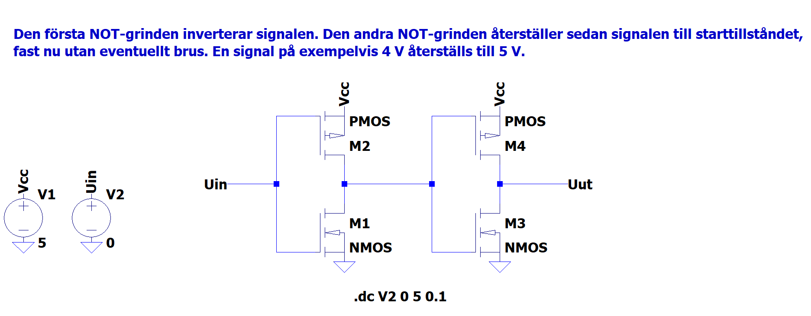

# Lösningsförslag - Uppgift 1

Buffern realiseras i from av två seriekopplade NOT-grindar, såsom visas nedan:

Nedanstående graf visar hur bufferns utsignal `Uut` normaliseras till närmaste heltal (0 eller 1) även om insignalen `Uin` har påverkats av brus eller andra störningar. Detta illustrerar bufferns förmåga att återställa en digital signal till ett tydligt logiskt värde.

Notera dock att kretsen inte är helt idealisk; om insignalen ligger nära tröskelvärdet mellan logisk 0 och 1 kan utsignalen bli osäker eller växla snabbt mellan nivåerna. I praktiken innebär detta att små variationer kring tröskeln kan leda till att utsignalen inte är helt stabil, vilket är en viktig aspekt att ta hänsyn till vid konstruktion av digitala kretsar.

Grindnätet kan simuleras i LTspice genom att importera filen [buffer.asc](./buffer.asc).