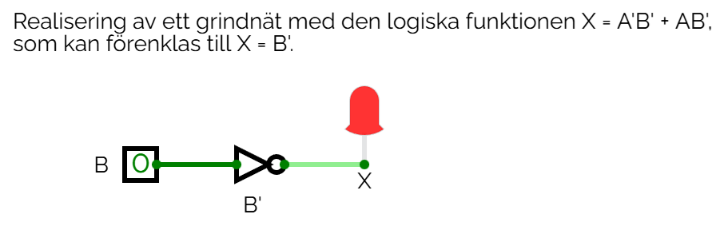

# Lösningsförslag - Uppgift 2

Följande grindnät ska realiseras:

| AB | X |
|----|---|
| 00 | 1 |
| 01 | 0 |
| 10 | 1 |
| 11 | 0 |

Vi ser att $X = 1$ om $AB = 00$ eller om $AB = 10$.
Algebraiskt kan vi därmed skriva  $X = A'B' + AB'$.

Vi förenklar detta algebraiskt genom att bryta ut $B'$:

```math
X = B'(A' + A),
```

där 

```math
A' + A = 1 + 0 = 1
```

därmed gäller att

```math
X = B'(A' + A) = B' * 1 = B'
```

Nätet kan därmed realiseras med en NOT-grind, såsom visas nedan:



Grindnätet kan simuleras i [CircuitVerse](https://circuitverse.org/simulator) genom att importera filen [net1.cv](./net1.cv).