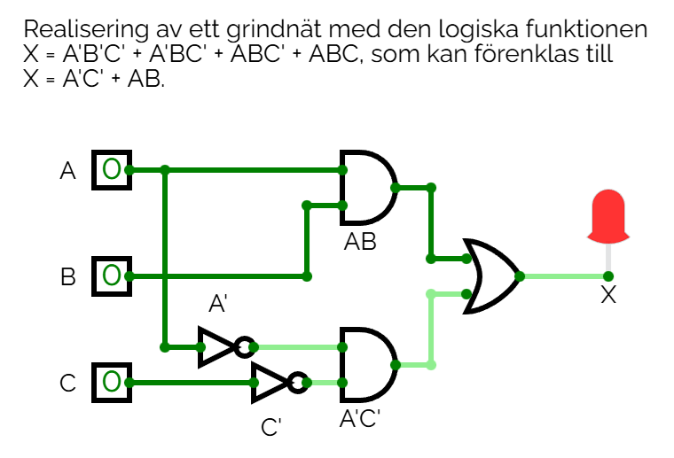

# Lösningsförslag - Uppgift 3

Följande grindnät ska realiseras:

| ABC | X |
|-----|---|
| 000 | 1 |
| 001 | 0 |
| 010 | 1 |
| 011 | 0 |
| 100 | 0 |
| 101 | 0 |
| 110 | 1 |
| 111 | 1 |

Vi ser att $X = 1$ för kombinationer $ABC = 000$, $010$, $110$ samt $111$, vilket kan utryckas i en boolesk ekvation:

```math
X = A'B'C' + A'BC' + ABC' + ABC
```

De två första termerna har $A'C'$ gemensamt, medan de två andra termerna har $AB$ gemensamt. Genom att bryta ut likheterna kan ovanstående ekvation förenklas till följande:

```math
X = A'C'(B' + B) + AB(C' + C)
```
där

```math
B' + B = 1 + 0 = 1
```

samt

```math
C' + C = 1 + 0 = 1
```

Därmed kan ekvationen förenklas till

```math
X = A'C' * 1 + AB * 1,
```

vilket är ekvivalent med

```math
X = A'C' + AB
```

Nätet kan därmed realiseras såsom visas nedan:



Grindnätet kan simuleras i [CircuitVerse](https://circuitverse.org/simulator) genom att importera filen [net2.cv](./net2.cv).