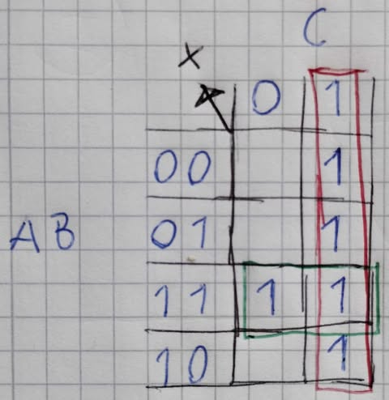
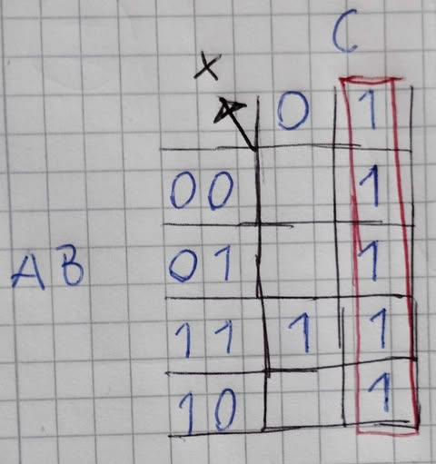
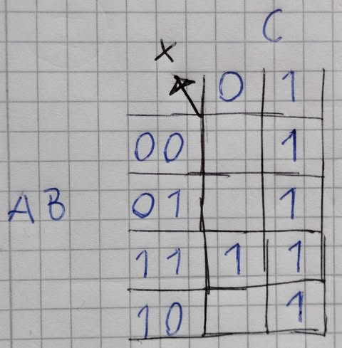
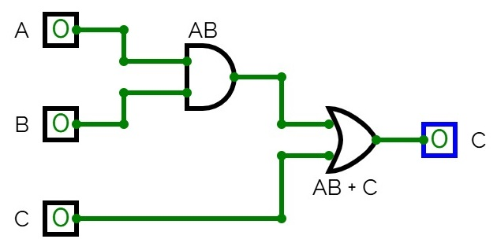

# L03 - Logiska grindnät (del III)

## Dagordning
* Mer arbete med logiska grindnät.
* AND- samt AND-grinden på transistornivå.
* Visuell minimering av logiska ekvationer med Karnaugh-diagram.

## Mål med lektionen
* Kunna minimera enkla logiska funktioner via användning av Karnaugh-diagram. 
* Kunna rita upp AND- och NAND-grinden med CMOS-transistorer och förklara dess funktion.

## Förutsättningar
* Genomgång av L02 för kunskap om algebraisk minimering av logiska grindnät.
* Grundläggande färdigheter i [CircuitVerse](https://circuitverse.org/simulator).

## Instruktioner

### Förberedelse
* Läs [Bilaga A](#bilaga-a---karnaugh-diagram) nedan för information om Karnaugh-diagram.

### Under lektionen
* Genomför bifogade [övningsuppgifter](#bilaga-b---övningsuppgifter) nedan.

### Demonstration
* Minimering av ett par logiska funktioner med Karnaugh-diagram, simulering i [CircuitVerse](https://circuitverse.org/simulator).
* Konstruktion av NAND-grinden med CMOS-transistorer i LTspice.

## Utvärdering
* Vad tyckte ni var mest intressant eller lärorikt under lektionen?
* Kan ni rita och förklara funktionen för en AND-grind på transistornivå?
* Känner ni er trygga med att minimera logiska funktioner med Karnaugh-diagram?
* Har ni förslag på förbättringar eller önskemål inför kommande lektioner?

## Nästa lektion
* Övningslabb som förberedelse inför P01.
* Mer träning på logisk minimering med Karnaugh-diagram.
* OR- samt NOR-grinden på transistornivå.

## Bilaga A - Karnaugh-diagram

Karnaugh-diagram är en metod för att visuellt förenkla booleska ekvationer, exempelvis för minimering av logiska grindnät:
* Karnaugh-diagrammet i sig utgör en tabell, där varje cell utgör en kombination av insignaler. 
* I cellen i fråga skriver man utsignalen `1` eller `0` för den givna kombinationen av insignaler.
* Vi ringar in ettor horisontellt eller vertikalt vars storlek är en potens av 2 (1, 2, 4, 8, 16 och så vidare). Grupperna kan vara horisontella eller vertikala, men inte sneda. 
* I tabellen skriver vi upp insignalerna som Gray-kod för för att säkerhetsställa att samtliga bredvidliggande celler har något gemensamt. Som exempel, med 2-bitars Gray-kod skriver vi upp signalerna i ordningen AB = 00, 01, 11, 10. Notera nu att gemensamheter mellan bredvidliggande celler, inklusive cellerna på ytterkanterna:
    * AB = 00 samt AB = 01 har gemensamt att A = 0.
    * AB = 01 samt AB = 11 har gemensamt att B = 1.
    * AB = 11 samt AB = 10 har gemensamt att A = 1.
    * AB = 10 samt AB = 00 har gemensamt att B = 0.
* Målet är att samtliga ettor ska ringas in i en grupp. Ju större block om ettor, desto mer kan vi förenkla ekvationen. Det är okej med overlapp mellan blocken.
* För varje block av ettor kontrollerar vi vad som är gemensamt. Som exempel, anta att vi har två block med ettor, `block1` samt `block2`:
    * Om alla ettor i `block1` har gemensamt att A = 0 samt B = 1 noterar vi att `block1 = A'B`. 
    * Om alla ettor i `block2` har gemensamt att C = 0 noterar vi att `block2 = C'`.
* När alla ettor har ringats in i (minst) en grupp summerar vi grupperna i en ekvation för utsignal X. För ovanstående exempel med `block1`
samt `block2` hade vi då fått följande ekvation:

```math
X = block1 + block2 = A'B + C'.
```
Vi summerar alltså samtliga grupper i ekvationen. Ekvationen är nu förenklad.

## Användning av Karnaugh-diagram

Anta att vi har ett logiskt grindnät med insignaler A, B och C samt utsignal X, vars sanningstabell visas nedan:

| A | B | C | X |
|---|---|---|---|
| 0 | 0 | 0 | 0 |
| 0 | 0 | 1 | 1 |
| 0 | 1 | 0 | 0 |
| 0 | 1 | 1 | 1 |
| 1 | 0 | 0 | 0 |
| 1 | 0 | 1 | 1 |
| 1 | 1 | 0 | 1 |
| 1 | 1 | 1 | 1 |

Vi ritar om sanningstabellen ovan till nedanstående Karnaugh-diagram:
* Vi placerar insignaler AB i y-led samt insignal C i x-led.
* Vi placerar AB i 2-bitars Grey-kod, alltså i ordningsföljden 00, 01, 11, 10, så att samtliga celler har en bit gemensam med samtliga intilliggande celler. Detta gäller även ytterkanterna, där AB = 00 samt AB = 10 har B = 0 gemensamt. Vi ser då enklare mönster och kan enkelt ringa in dessa för att erhålla en minimerad ekvation för utsignal X.
* Vi lägger till ettor i de celler där X = 1. I sanningstabellen ser vi att X = 1 för kombinationer ABC = 001, 011, 101, 110 samt 111. I övriga rutor kan vi lägga till nollor, men för att göra det enkelt kan vi strunta i detta, då vi endast är intresserad av ettorna.

Karnaugh-diagrammet kan därmed ritas ut så som visas nedan:



Vi noterar i Karnaugh-diagrammet ovan att vi får fyra ettor i kolumnen då C = `1`. Vi ringar in dessa i rött:



Som sagt har dessa ettor gemensamt att C = `1`. Därmed gäller för detta block att X = `1` då C = `1`. vilket på boolesk algrebra skrivs enligt nedan:

```math
X = C
```

Vi noterar också att vi har ett par ettor bredvid varandra på den rad då AB = `11`. Vi ringar in dessa i grönt:



Som sagt har dessa ettor gemensamt att AB = `11`, vilket på boolesk algrebra skrivs enligt nedan:

```math
X = AB
```

Eftersom samtliga ettor nu är inrutade i ett block är ekvationen slutförd. Vi summerar ekvationerna för respektive block
och erhåller då följande ekvation:

```math
X = AB + C
```

Grindnätet kan därmed realiseras via två grindar:
* En AND-grind med insignaler A och B. Utsignalen blir då AB.
* En OR-grind med insignaler AB samt C. Vi använder utsignalen ur tidigare nämnd AND-grind för att erhålla insignal AB.

Motsvarande grindnät visas nedan:



---


## Bilaga B - Övningsuppgifter

**1.** Rita ut en AND-grind med CMOS-transistorer i LTspice.  
***Tips**: AND-grinden kan implementeras som en NAND-grind i serie med en NOT-grind.*

---

**2.** Härled en minimerad logisk ekvation för utsignal X ur nedanstående sanningstabell via ett Karnaugh-diagram och realisera motsvarande grindnät. Simulera konstruktionen i CircuitVerse.

| ABC | X |
|-----|---|
| 000 | 1 |
| 001 | 1 |
| 010 | 0 |
| 011 | 0 |
| 100 | 1 |
| 101 | 1 |
| 110 | 0 |
| 111 | 0 |

---

**3.** Härled en minimerad logisk ekvation för utsignal X ur nedanstående sanningstabell via ett Karnaugh-diagram, realisera motsvarande grindnät. Simulera konstruktionen i CircuitVerse.

| ABCD | X |
|------|---|
| 0000 | 0 |
| 0001 | 1 |
| 0010 | 0 |
| 0011 | 1 |
| 0100 | 0 |
| 0101 | 0 |
| 0110 | 0 |
| 0111 | 0 |
| 1000 | 0 |
| 1001 | 1 |
| 1010 | 0 |
| 1011 | 1 |
| 1100 | 1 |
| 1101 | 0 |
| 1110 | 1 |
| 1111 | 0 |

---

**4.** Härled minimerade logiska ekvationer för utsignaler X och Y ur nedanstående sanningstabell via ett Karnaugh-diagram och realisera grindnätet. Simulera konstruktionen i CircuitVerse.

| ABCD | XY |
|------|----|
| 0000 | 01 |
| 0001 | 00 |
| 0010 | 00 |
| 0011 | 01 |
| 0100 | 11 |
| 0101 | 10 |
| 0110 | 10 |
| 0111 | 11 |
| 1000 | 11 |
| 1001 | 10 |
| 1010 | 10 |
| 1011 | 11 |
| 1100 | 01 |
| 1101 | 00 |
| 1110 | 00 |
| 1111 | 01 |

---
