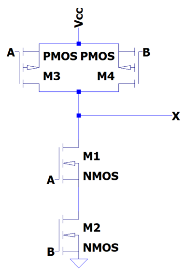
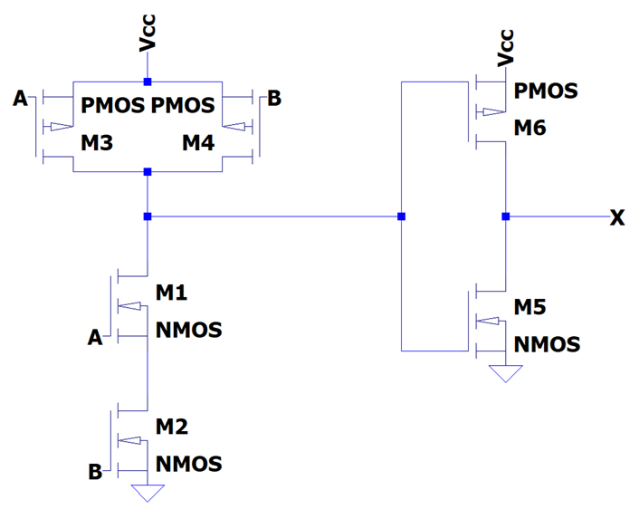

# Lösningsförslag - Uppgift 1

AND-grinden realiseras i form av en NAND-grind följt av en NOT-grind.

Vi realiserar först en AND-grind och adderar sedan en NOT-grind. Vi använde NOT-grindar under föregående lektion för att realisera en [buffer](../../../L02/solutions/exercise1/README.md).

## Konstruktion av en NAND-grind
En logisk grind består av ett övre och ett nedre nät. Det nedre nätet kallas pulldown-nät och består utav NMOS-transistorer. För att realisera en NAND grind behöver den logiska funktionen $X = A * B$ realiseras. För att åstadkomma detta ska pulldown-nätet realisera funktionen $A * B$, vilket åstadkommes genom att seriekoppla två NMOS-transistorer med $A$ och $B$ som insignaler. Då måste både $A$ och $B$ vara höga för att vägen mellan jord och utsignal $X$ ska vara fri, annars är vägen spärrad.

Det övre nätet kallas pullup-nät och består utav PMOS-transistorer. Eftersom detta ska utgöra raka motsatsen till pulldown-nätet (när det ena leder ska det andra spärra) sätts dessa till den inversa funktionen. De Morgans teorem ger att $(A * B)' = A' + B'$. Därmed placerar vi två PMOS-transistorer parallellt, där det räcker med att antingen $A$ eller $B$ är lika med $0$ för att vägen mellan matningsspänningen $Vcc$ och utsignal $X$ ska vara fri, annars är båda vägar spärrade.

Genom att sätta ihop pulldown- och pullup-nätet erhålls NAND-grinden såsom visas nedan:

## Konstruktion av en AND-grind
Vi kopplar sedan utgången till en NOT-grind för att realisera AND-grinden, såsom visas nedan:

Grindnätet kan simuleras i LTspice genom att importera filen [and.asc](./and.asc).

---
