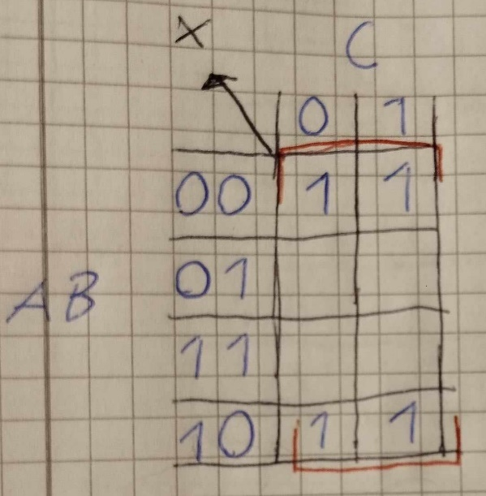

# Lösningsförslag - Uppgift 2

Den logiska ekvationen för ett grindnät med nedanstående sanningstabell ska bestämmas via ett Karnaugh-diagram:

| ABC | X |
|-----|---|
| 000 | 1 |
| 001 | 1 |
| 010 | 0 |
| 011 | 0 |
| 100 | 1 |
| 101 | 1 |
| 110 | 0 |
| 111 | 0 |


Vi ritar om sanningstabellen ovan till nedanstående Karnaugh-diagram:



Vi placerar insignaler $AB$ i y-led samt insignal $C$ i x-led. Vi placerar $AB$ i 2-bitars Grey-kod, alltså i ordningsföljden $00, 01, 11, 10$, så att samtliga celler har en bit gemensam med samtliga intilliggande celler. Detta gäller även ytterkanterna, där $AB = 00$ samt $AB = 10$ har $B = 0$ gemensamt. Vi ser då enklare mönster och kan enkelt ringa in dessa för att erhålla en minimerad ekvation för utsignal $X$.

Vi lägger till ettor i de celler där $X = 1$. I sanningstabellen ser vi att $X = 1$ för kombinationer $ABC = 000, 001, 100$ samt $101$. I övriga rutor kan vi lägga till nollor, men för att göra det enkelt kan vi strunta i detta, då vi endast är intresserad av ettorna.

Vi noterar i Karnaugh-diagrammet ovan att vi får fyra ettor "jämte varandra" i ytterkanterna, alltså då $AB = 00$ samt $AB = 11$. Vi ringer in dessa ettor och noterar att dessa ettor enbart har $B = 0$ gemensamt. Därmed gäller att $X = 1$ då $B = 0$, vilket på boolesk algebra skrivs enligt nedan:

```math
X = B'
```

Eftersom inga ettor kvarstår är ekvationen slutförd. Grindnätet kan därmed realiseras med enbart en NOT-grind, såsom visas nedan:


---
