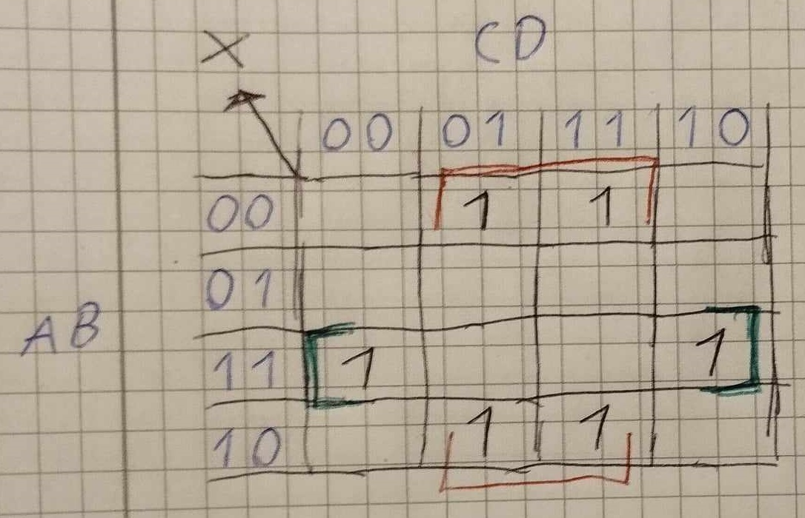
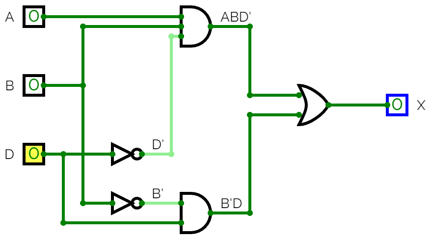

# Lösningsförslag - Uppgift 3

Den logiska ekvationen för ett grindnät med nedanstående sanningstabell ska bestämmas via ett Karnaugh-diagram:

| ABCD | X |
|------|---|
| 0000 | 0 |
| 0001 | 1 |
| 0010 | 0 |
| 0011 | 1 |
| 0100 | 0 |
| 0101 | 0 |
| 0110 | 0 |
| 0111 | 0 |
| 1000 | 0 |
| 1001 | 1 |
| 1010 | 0 |
| 1011 | 1 |
| 1100 | 1 |
| 1101 | 0 |
| 1110 | 1 |
| 1111 | 0 |

Vi ritar om sanningstabellen ovan till nedanstående Karnaugh-diagram:



Vi placerar insignaler $AB$ i y-led samt insignaler $CD$ i x-led. Vi placerar $AB$ samt $CD$ i 2-bitars Grey-kod, alltså i ordningsföljden $00, 01, 11, 10$, så att samtliga celler har en bit gemensam med samtliga intilliggande celler, inklusive ytterkanterna.

Vi lägger till ettor i de celler där $X = 1$. I sanningstabellen ser vi att $X = 1$ för kombinationer $ABCD = 0001, 0011, 1001, 1011, 1100$ samt $1110$. Återigen struntar vi att skriva ut nollor i övriga rutor, då vi enbart är intresserade av ettorna.

Vi noterar i Karnaugh-diagrammet ovan att vi får fyra ettor "jämte varandra" i ytterkanterna, alltså då $AB = 00$ samt $AB = 11$, samtidigt som $CD = 01$ eller $11$. Dessa ettor är inringade i rött ovan. Vi ringer in dessa ettor och noterar att dessa ettor enbart har $B = 0$ samt $D = 1$ gemensamt. För dessa fyra ettor gäller att $X = 1$ då $BD = 01$, vilket på boolesk algebra skrivs enligt nedan:

```math
X = B'D
```

Vi är dock inte klara, då det återstår två ettor, som är inringade i grönt ovan. Dessa ligger i ytterkanterna på en gemensam rad och har därmed något gemensamt. Vi noterar att de har gemensamt att $A = 1$, $B = 1$ samt $D = 0$. För dessa ettor gäller att $X = 1$ då $A = 1$, $B = 1$ och $D = 0$, vilket på boolesk algebra skrivs enligt nedan:

```math
X = ABD'
```

Sammanfattat gäller att utsignal $X = 1$ då $BD = 01$ eller $ABD = 110$, vilket på boolesk algebra skrivs enligt nedan:

```math
X = B'D + ABD'
```

Vi kan därefter realisera grindnätet med två NOT-grindar, två AND-grindar samt en OR-grind, såsom visas nedan:



---
