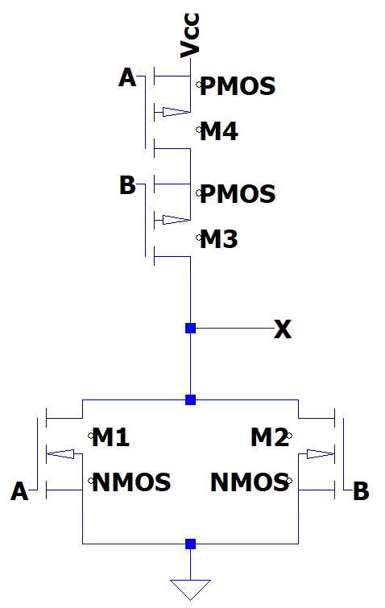

# Lösningsförslag - Uppgift 1

OR-grinden realiseras i form av en OR-grind följt av en NOT-grind.

Vi realiserar först en OR-grind och adderar sedan en NOT-grind. Vi använde NOT-grindar under L02 för att realisera en [buffer](../../../L02/solutions/exercise1/README.md).

## Konstruktion av en NOR-grind
En logisk grind består av ett övre och ett nedre nät. Det nedre nätet kallas pulldown-nät och består utav NMOS-transistorer. För att realisera en NOR grind behöver den logiska funktionen $X = A + B$ realiseras. För att åstadkomma detta ska pulldown-nätet realisera funktionen $A + B$, vilket åstadkommes genom att parallellkoppla två NMOS-transistorer med $A$ och $B$ som insignaler. Då räcker det med att antingen $A$ eller $B$ är hög för att vägen mellan jord och utsignal $X$ ska vara fri. Endast om både $A$ eller $B$ är låga är vägen spärrad.

Det övre nätet kallas pullup-nät och består utav PMOS-transistorer. Eftersom detta ska utgöra raka motsatsen till pulldown-nätet (när det ena leder ska det andra spärra) sätts dessa till den inversa funktionen. De Morgans teorem ger att $(A + B)' = A' * B'$. Därmed placerar vi två PMOS-transistorer seriellt, vilket medför att båda $A$ och $B$ måste vara lika med $0$ för att vägen mellan matningsspänningen $Vcc$ och utsignal $X$ ska vara fri, annars är vägen spärrad.

Genom att sätta ihop pulldown- och pullup-nätet erhålls NOR-grinden såsom visas nedan:

## Konstruktion av en NOR-grind
Vi kopplar sedan utgången till en NOT-grind för att realisera OR-grinden, såsom visas nedan:

Grindnätet kan simuleras i LTspice genom att importera filen [or.asc](./or.asc).

---
