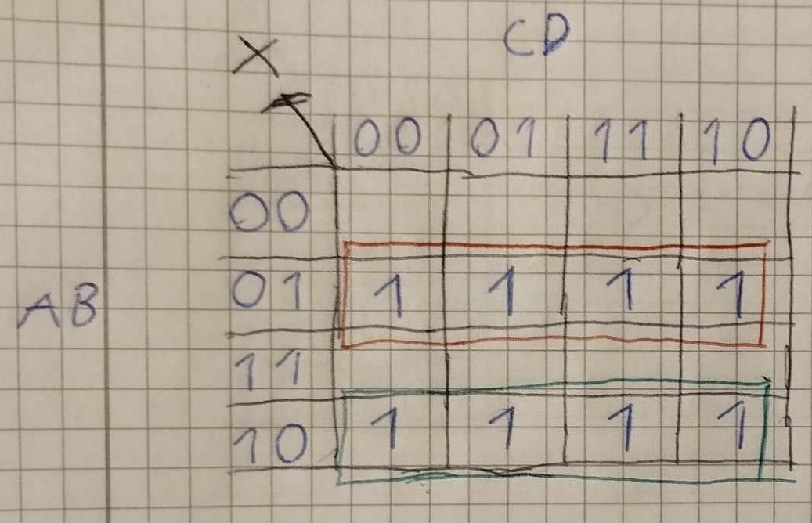
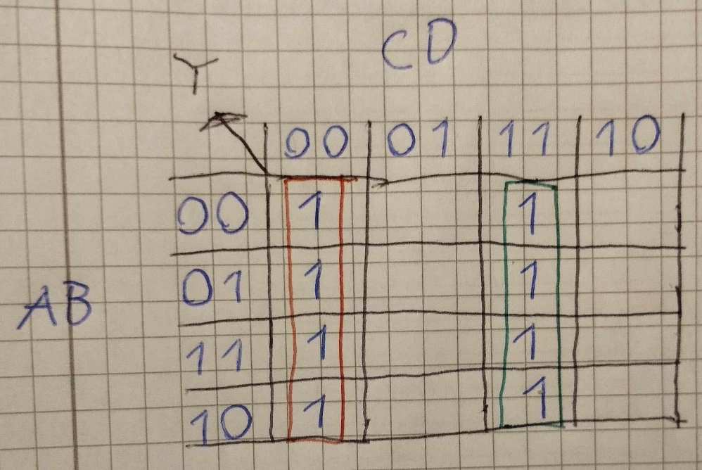
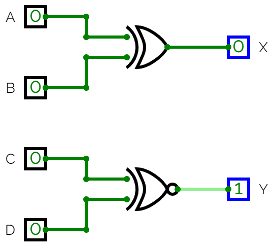

# Lösningsförslag - Uppgift 2

Den logiska ekvationen för ett grindnät med nedanstående sanningstabell ska bestämmas via ett Karnaugh-diagram:

| ABCD | XY |
|------|----|
| 0000 | 01 |
| 0001 | 00 |
| 0010 | 00 |
| 0011 | 01 |
| 0100 | 11 |
| 0101 | 10 |
| 0110 | 10 |
| 0111 | 11 |
| 1000 | 11 |
| 1001 | 10 |
| 1010 | 10 |
| 1011 | 11 |
| 1100 | 01 |
| 1101 | 00 |
| 1110 | 00 |
| 1111 | 01 |

Vi ritar om sanningstabellen ovan till Karnaugh-diagram. Eftersom två utsignaler förekommer i detta fall behövs två Karnaugh-diagram. Vi börjar med att rita ett Karnaugh-diagram för utsignal $X$:



Vi placerar insignaler $AB$ i y-led samt insignaler $CD$ i x-led. Vi placerar $AB$ samt $CD$ i 2-bitars Grey-kod, alltså i ordningsföljden $00, 01, 11, 10$, så att samtliga celler har en bit gemensam med samtliga intilliggande celler, inklusive ytterkanterna.

Vi lägger till ettor i de celler där $X = 1$. I sanningstabellen ser vi att $X = 1$ för kombinationer $ABCD = 0100, 0101, 0110, 0111, 1000, 1001, 1010$ samt $1011$. Återigen struntar vi att skriva ut nollor i övriga celler, då vi enbart är intresserade av ettorna.

Vi noterar i Karnaugh-diagrammet ovan att vi får två rader med fyra ettor fyra "jämte varandra". Vi ringar in dessa med röd respektive grön färg: 
* De fyra ettor som är inringade i rött har gemensamt att $A = 0$ samt $B = 1$. 
* De fyra ettor som är inringade i grönt har gemensamt att $A = 1$ samt $B = 0$. 
Därmed gället att $X = 1$ om $AB = 01$ eller $AB = 10$, vilket på boolesk algebra skrivs enligt nedan:

```math
X = A'B + AB'
```
Notera att detta är ett XOR-mönster; insignaler $A$ och $B$ måste ha motsatt värde (den ena ska vara $0$ och den andre ska vara $1$) för att utsignal $X$ ska bli lika med $1$. Därmed gäller att

```math
X = A ^ B
```

Grindnätet för utsignal $X$ kan därmed realiseras via en XOR-grind med $A$ och $B$ som insignaler.

Vi ritar sedan ett Karnaugh-diagram för utsignal $Y$:



Vi placerar insignaler $AB$ i y-led samt insignaler $CD$ i x-led. Vi placerar $AB$ samt $CD$ i 2-bitars Grey-kod, alltså i ordningsföljden $00, 01, 11, 10$, så att samtliga celler har en bit gemensam med samtliga intilliggande celler, inklusive ytterkanterna.

Vi lägger till ettor i de celler där $Y = 1$. I sanningstabellen ser vi att $Y = 1$ för kombinationer $ABCD = 0000, 0100, 1000, 1100, 0011, 0111, 1011$ samt $1111$. Även denna gång struntar vi att skriva ut nollor i övriga rutor, då vi enbart är intresserade av ettorna.

Vi noterar i Karnaugh-diagrammet ovan att vi får två rader med fyra ettor "jämte varandra". Vi ringar in dessa med röd respektive grön färg. De fyra ettor som är inringade i rött har gemensamt att $C = 0$ samt $D = 0$. De fyra ettor som är inringade i grönt har gemensamt att $C = 1$ samt $D = 1$. Därmed gället att $Y = 1$ om $CD = 00$ eller $CD = 11$, vilket på boolesk algebra skrivs enligt nedan:

```math
Y = C'D' + CD
```

Notera att detta är ett XNOR-mönster; $C$ och $D$ måste ha samma värde (antingen $0$ eller $1$) för att utsignal $Y$ ska bli $1$. Därmed gäller att

```math
Y = (C ^ D)'
```

Grindnätet för utsignal $Y$ kan därmed realiseras via en XNOR-grind med $C$ och $D$ som insignaler.

Vi har därmed härlett följande ekvationer:

```math
X = A ^ B
Y = (C ^ D)'
```

Grindnätet kan därmed realiseras såsom visas nedan:



---
