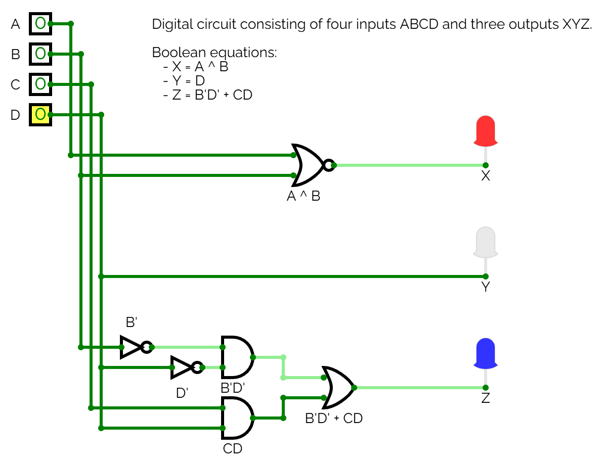

# L08 - Anteckningar

Syntes samt simulering av ett grindnät bestående av fyra insignaler `ABCD` samt tre utsignaler `XYZ`. Grindnätets sanningstabell visas nedan:

| ABCD | XYZ |   
|------|-----|
| 0000 | 001 |
| 0001 | 010 |
| 0010 | 001 |
| 0011 | 011 |
| 0100 | 100 |
| 0101 | 110 |
| 0110 | 100 |
| 0111 | 111 |
| 1000 | 101 |
| 1001 | 110 |
| 1010 | 101 |
| 1011 | 111 |
| 1100 | 000 |
| 1101 | 010 |
| 1110 | 000 |
| 1111 | 011 |

## Booleska ekvationer
Med Karnaugh-diagram erhölls följande booleska ekvationer:

```
X = A ^ B
Y = D`
Z = B'D' + CD
```

## Grindnät

Grindnätet kan realiseras såsom visas nedan:



Ovanstående grindnät kan simuleras i [CircuitVerse](https://circuitverse.org/simulator) genom att importera [net1.cv](./net1.cv).

## VHDL-implementation
* Filen [net1.vhd](./net1.vhd) innehåller modulen `net1`, som utgör själva grindnätet.
* Filen [net1_tb.vhd](./net1_tb.vhd) utgör en testbänk för modulen `net1`.
* Filen [net1.qar](./net1.qar) utgör en arkiverad projektfil, som kan användas för att direkt öppna projektet, inklusive pins och testbänk, i Quartus.

---
