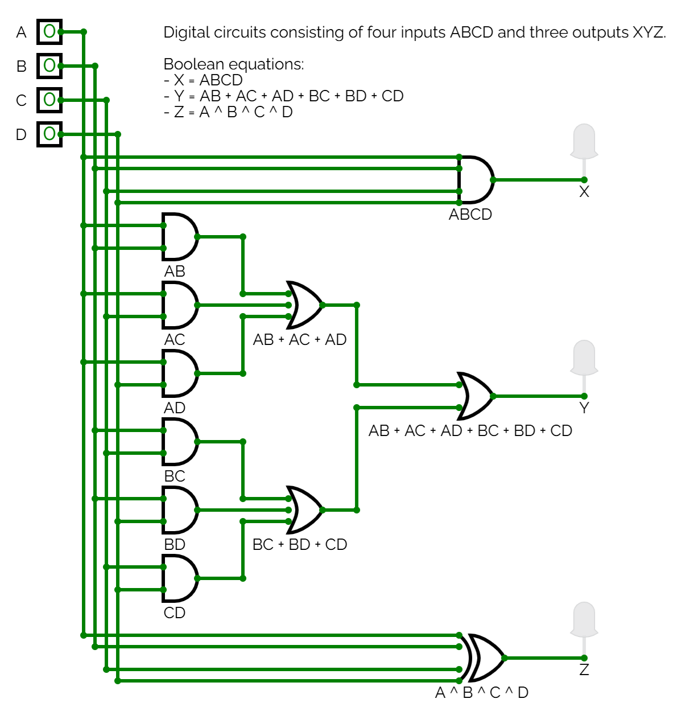

# L09 - Anteckningar

Syntes samt simulering av ett grindnät bestående av fyra insignaler `ABCD` samt tre utsignaler `XYZ`. Grindnätets sanningstabell visas nedan:

| ABCD | XYZ |   
|------|-----|
| 0000 | 000 |
| 0001 | 001 |
| 0010 | 001 |
| 0011 | 010 |
| 0100 | 001 |
| 0101 | 010 |
| 0110 | 010 |
| 0111 | 011 |
| 1000 | 001 |
| 1001 | 010 |
| 1010 | 010 |
| 1011 | 011 |
| 1100 | 010 |
| 1101 | 011 |
| 1110 | 011 |
| 1111 | 110 |

## Booleska ekvationer
Med Karnaugh-diagram erhölls följande booleska ekvationer:

```
X = ABCD
Y = AB + AC + AD + BC + BD + CD
Z = A ^ B ^ C ^ D
```

## Grindnät

Grindnätet kan realiseras såsom visas nedan:



Ovanstående grindnät kan simuleras i [CircuitVerse](https://circuitverse.org/simulator) genom att importera [net2.cv](./net2.cv).

## VHDL-implementation
* Filen [net2.vhd](./net2.vhd) innehåller modulen `net2`, som utgör själva grindnätet.
* Filen [net2_tb.vhd](./net2_tb.vhd) utgör en testbänk för modulen `net2`.
* Filen [net2.qar](./net2.qar) utgör en arkiverad projektfil, som kan användas för att direkt öppna projektet, inklusive pins och testbänk, i Quartus.

---
