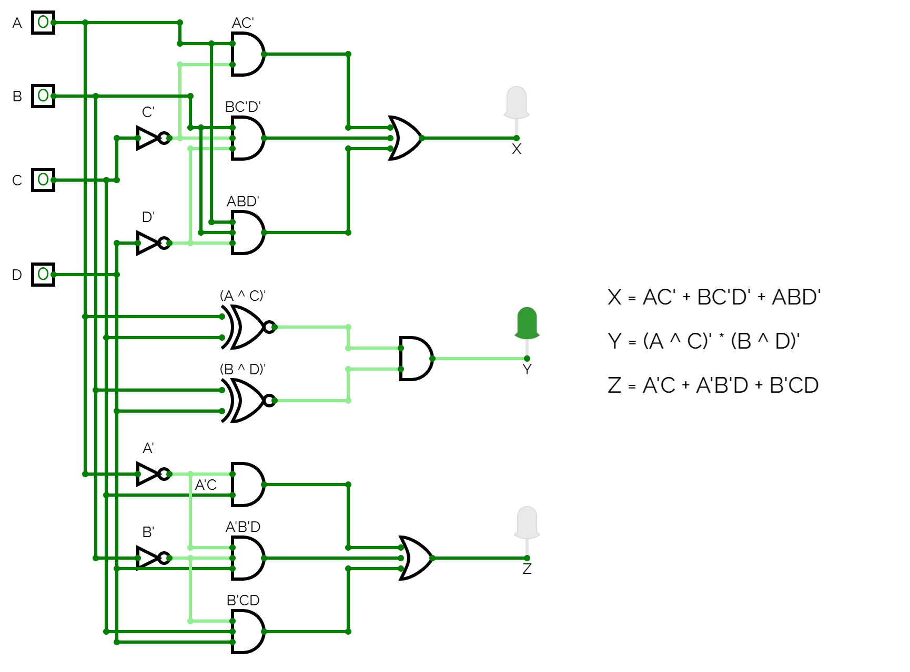
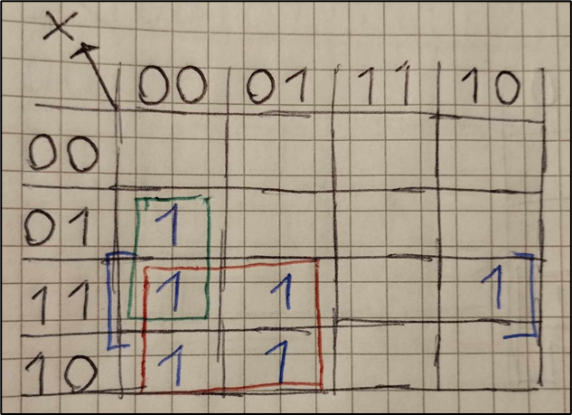
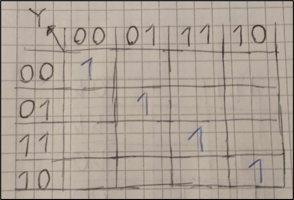
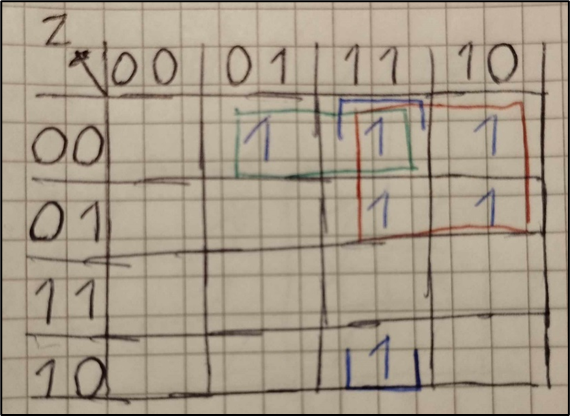

# L10 - Anteckningar

Syntes samt simulering av en 4-bitars komparator bestående av fyra insignaler `ABCD` samt tre utsignaler `XYZ`. Grindnätets sanningstabell visas nedan:

| ABCD | XYZ |   
|------|-----|
| 0000 | 010 |
| 0001 | 001 |
| 0010 | 001 |
| 0011 | 001 |
| 0100 | 100 |
| 0101 | 010 |
| 0110 | 001 |
| 0111 | 001 |
| 1000 | 100 |
| 1001 | 100 |
| 1010 | 010 |
| 1011 | 001 |
| 1100 | 100 |
| 1101 | 100 |
| 1110 | 100 |
| 1111 | 010 |

## Booleska ekvationer
Följande booleska ekvationer togs fram, se [bilaga A](#bilaga-a---härledning-av-booleska-ekvationer) nedan för härledningar:

```
X = AC' + BD'(A + C')
Y = (A ^ C)' * (B ^ D)',
Z = A'C + B'D(A' + C)
```

## Grindnät

Grindnätet kan realiseras såsom visas nedan:



Ovanstående grindnät kan simuleras i [CircuitVerse](https://circuitverse.org/simulator) genom att importera [comparator_4bit.cv](./comparator_4bit.cv).

## VHDL-implementation
* Filen [comparator_4bit.vhd](./comparator_4bit.vhd) innehåller modulen `comparator_4bit`, som utgör själva komparatorn.
* Filen [comparator_4bit_tb.vhd](./comparator_4bit_tb.vhd) utgör en testbänk för modulen `comparator_4bit`.
* Filen [comparator_4bit.qar](./comparator_4bit.qar) utgör en arkiverad projektfil, som kan användas för att direkt öppna projektet, inklusive pins och testbänk, i Quartus.

---

## Bilaga A - Härledning av booleska ekvationer

Vi ritar om sanningstabellen ovan till nedanstående Karnaugh-diagram för respektive utsignal 
`X`, `Y` och `Z`. 

### Härledning av ekvation för utsignal `X`

Vi börjar med att rita Karnaugh-diagram för utsignal `X`:



Vi placerar insignaler `AB` i y-led samt insignaler `CD` i x-led. Vi placerar `AB` samt `CD` i 2-bitars Grey-kod, alltså i ordningsföljden `00`, `01`, `11`, `10`, så att samtliga celler har en bit gemensam med samtliga intilliggande celler, inklusive ytterkanterna.

Vi lägger till ettor i de celler där `X = 1`. I sanningstabellen ser vi att `X = 1` för kombinationer `ABCD = 0100, 1000, 1001, 1100, 1101 samt 1110`. Vi struntar i att skriva ut nollor i övriga celler, då vi enbart är intresserade av ettorna.

Vi noterar i Karnaugh-diagrammet ovan att vi får tre block innehållande ettor. Vi ringar in dessa block med röd, grön respektive blå färg:
* De fyra ettor som är inringade i rött har gemensamt att `A = 1` samt `C = 0`. 
* De två ettor som är inringade i grönt har gemensamt att `B = 1`, `C = 0` samt `D = 0`.
* De ettor som är inringade i blått har gemensamt att `A = 1`, `B = 1` samt `D = 0`.

Därmed gället att `X = 1` om `AC = 10`, `BCD = 100` eller `ABD = 110`, vilket på boolesk algebra skrivs enligt nedan:

```
X = AC' + BC'D' + ABD'
```

Genom att bryta ut BD' ut de två sista faktorerna kan ovanstående ekvation skrivas om till följande:

```
X = AC' + BD'(A + C')
```

### Härledning av ekvation för utsignal `Y`

Vi ritar sedan Karnaugh-diagram för utsignal Y:



Vi placerar insignaler `AB` i y-led samt insignaler `CD` i x-led. Vi placerar `AB` samt `CD` i 2-bitars Grey-kod, alltså i ordningsföljden `00`, `01`, `11`, `10`, så att samtliga celler har en bit gemensam med samtliga intilliggande celler, inklusive ytterkanterna.

Vi lägger till ettor i de celler där `Y = 1`. I sanningstabellen ser vi att `Y = 1` för kombinationer `ABCD = 0000, 0101, 1010 samt 1111`. Återigen struntar vi att skriva ut nollor i övriga celler, då vi enbart är intresserade av ettorna.

Vi noterar i Karnaugh-diagrammet ovan att vi inte har några ettor som är gemensamma. Vi löser därmed ekvationen algebraiskt.

I sanningstabellen ser vi att `Y = 1` för kombinationer `ABCD = 0000, 0101, 1010` samt `1111`, vilket på boolesk algebra skrivs enligt nedan:

```
Y = A'B'C'D' + A'BC'D + AB'CD' + ABCD
```

Ovanstående ekvation kan förenklas till

```
Y = A'C'(B'D' + BD) + AC(B'D' + BD),
```

där

```
B'D' + BD = (B ^ D)'
```

Därmed gäller att

```
Y = A'C'(B ^ D)' + AC(B ^ D)'
```

Genom att bryta ut `(B ^ D)'` får vi att

```
Y=(B ^ D)'(A'C' + AC),
```

där

```
A'C' + AC = (A ^ C)'
```

Därmed gäller att

```
Y = (A ^ C)' * (B ^ D)',
```

vilket indikerar att `Y = 1` om `A = C` samtidigt som `B = D`.

### Härledning av ekvation för utsignal `Z`

Vi ritar sedan Karnaugh-diagram för utsignal `Z`:



Vi lägger till ettor i de celler där `Z = 1`. I sanningstabellen ser vi att `Z = 1` för kombinationer `ABCD = 0001, 0010, 0011, 0110, 0111 samt 1011`. Som tidigare skriver vi inte ut nollor i övriga celler, då vi enbart är intresserade av ettorna.

Vi noterar i Karnaugh-diagrammet ovan att vi får tre block innehållande ettor. Vi ringar in dessa block med röd, grön respektive blå färg:
* De fyra ettor som är inringade i rött har gemensamt att `A = 0` samt `C = 1`.
* De två ettor som är inringade i grönt har gemensamt att `A = 0`, `B = 0` och `D = 1`.
* De ettor som är inringade i blått har gemensamt att `B = 0`, `C = 1` samt `D = 1`.

Därmed gället att `Z = 1` om `AC = 01`, `ABD = 001` eller `BCD = 011`, vilket på boolesk algebra skrivs enligt nedan:

```
Z = A'C + A'B'D + B'CD
```

Genom att bryta ut `B'D` ut de två sista faktorerna kan ovanstående ekvation skrivas om till följande:

```
Z = A'C + B'D(A' + C)
```

---
