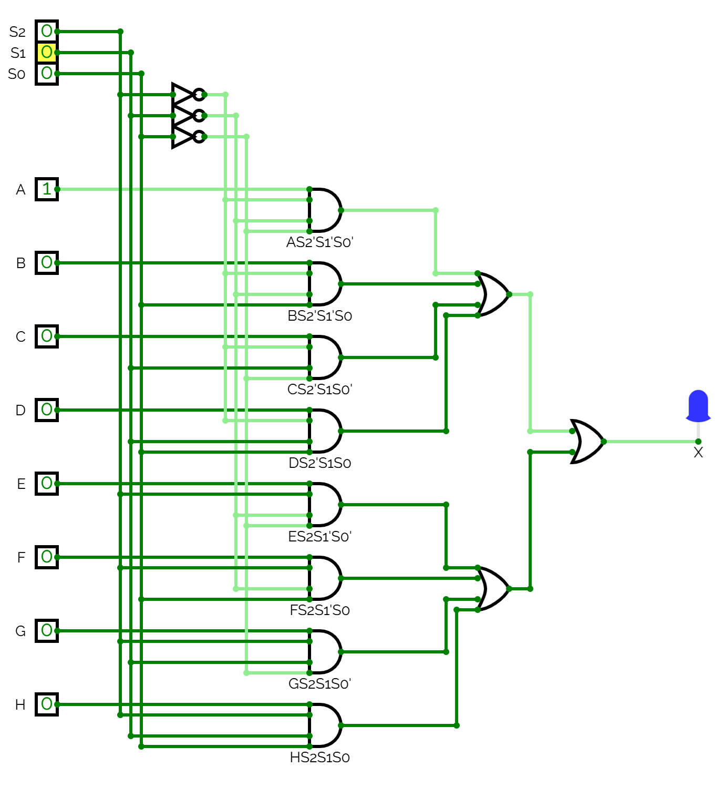

# L12 - Anteckningar

Syntes samt simulering av en *8-to-1 multiplexer* för mikrodatorn ATmega328P, som medför att analoga kanaler PORTC0 – PORTC7 kan dela på en enda AD-omvandlare.

Enbart en av de analoga kanalernas insignaler släpps igenom till AD-omvandlaren vid ett givet tillfälle, vilket kontrolleras via selektorbitar `MUX[2:0]` i registret `ADMUX` (*ADC Multiplexer Select Register*) enligt tabellen nedan:

| MUX[2:0] | Kanal  |
|--------:|--------|
| 000 | PORTC0 |
| 001 | PORTC1 |
| 010 | PORTC2 |
| 011 | PORTC3 |
| 100 | PORTC4 |
| 101 | PORTC5 |
| 110 | PORTC6 |
| 111 | PORTC7 |

---

För läsbarhetens skull har vi satt att:
* A - H = `PORTC[7:0]`
* S[2:0] = `MUX[2:0]`

Vi betecknar också multiplexerns utsignal till `X`.

Sanningstabellen ovan kan därmed skrivas om såsom visas nedan:

| S[2:0] | X |
|-------:|---|
| 000 | A |
| 001 | B |
| 010 | C |
| 011 | D |
| 100 | E |
| 101 | F |
| 110 | G |
| 111 | H |

## Booleska ekvationer
Följande booleska ekvationer togs fram:

```
X = A * S2'S1'S0' + B * S2'S1'S0 + C * S2'S1S0' + D * S2'S1S0 
  + E * S2S1'S0' + F * S2S1'S0 + G * S2S1S0' + H * S2S1S0
```

## Grindnät

Grindnätet kan realiseras såsom visas nedan:



Ovanstående grindnät kan simuleras i [CircuitVerse](https://circuitverse.org/simulator) genom att importera [mux_8_to_1.cv](./mux_8_to_1.cv).

## VHDL-implementation
* Filen [mux_8_to_1.vhd](./mux_8_to_1.vhd) innehåller modulen `mux_8_to_1`, som utgör själva multiplexern.
* Filen [mux_8_to_1.qar](./mux_8_to_1.qar) utgör en arkiverad projektfil, som kan användas för att direkt öppna projektet, inklusive pins och testbänk, i Quartus.

---
