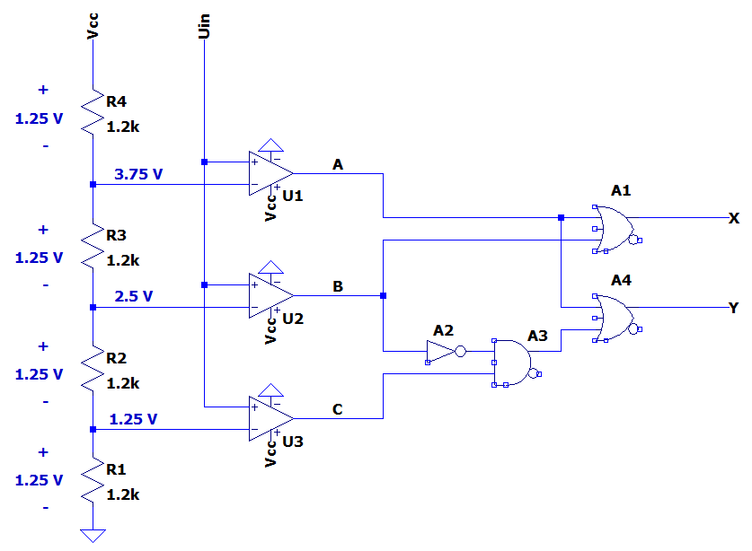

# L13 - Anteckningar
Realisering av en 2-bitars AD-omvandlare bestående av:
* En analog del innefattande en 3-nivåers spänningsdelare samt komparatorer (i form av OP-förstärkare).
* En digital del innefattande en 2-bitars prioritetsavkodare med insignaler `A`, `B` och `C` samt utsignaler `X` och `Y`.

Detta är en förenklad variant av en flash-omvandlare där komparatorernas utsignaler bildar en så kallad termometerkod `ABC`, som sedan omvandlas till binärkod `XY` av prioritetsavkodaren:

```
Uin → Komparatorer → Termometerkod (ABC) → Prioritetsavkodare → XY
```

## Hårdvara
För en 2-bitars AD-omvandlare behövs:
* `2^2` = 4 resistorer i en spänningsdelare för att ge tre olika spänningsnivåer.
* `2^2 - 1` = 3 komparatorer för att jämföra inspänningen `Uin` mot de olika spänningsnivåerna.

Matningsspänningen `Vcc` har satts till `5 V`:
* Då vi har fyra resistorer i spänningsdelaren blir upplösningen `5 V / 4 = 1.25 V` per kvantiseringssteg. Upplösningen är alltså mycket låg, men principen är densamma för AD-omvandlare med högre upplösning - det enda som krävs är mer hårdvara.
* För att hålla nere strömförbrukningen och samtidigt hålla nere resistorrelaterat brus sätts strömmen `I` genom spänningsdelaren till ca `1 mA`. Eftersom vi har fyra resistorer behövs därmed en total resistans `Rtot` på ca `5 kΩ`, då

```math
Rtot = \frac{Vcc}{I} = \frac{5}{1m} = 5\,\,kΩ
```

Eftersom fyra lika stora resistorer ska användas i spänningsdelaren sätts respektive resistor till `5 / 4 = 1.25 kΩ`. Närmaste värde i E12-serien är `1.2 kOhm`. Strömmen `I` genom spänningsdelaren blir då ca `1.04 mA`, då

```math
I = \frac{Vcc}{Rtot} = \frac{5}{4 * 1.2k} \approx 1.04\,\,mA
```

| Inspänning `Uin`       | Termometerkod `ABC` | Binärkod `XY` | Digital nivå |
| ---------------------- | ------------------- | ------------- | ------------ |
| `0 V ≤ Uin < 1.25 V`   | `000`               | `00`          | 0            |
| `1.25 V ≤ Uin < 2.5 V` | `001`               | `01`          | 1            |
| `2.5 V ≤ Uin < 3.75 V` | `011`               | `10`          | 2            |
| `3.75 V ≤ Uin ≤ 5 V`   | `111`               | `11`          | 3            |

Notera att:
* Termometerkoden alltid är kumulativ — när en högre komparator aktiveras är även alla lägre komparatorer aktiva.
* Upplösningen är 2 bitar men att hårdvaran växer exponentiellt med antalet bitar, då en n-bitars flash-omvandlare kräver `2^n` resistorer samt  `2^n - 1` komparatorer.

## Ekvationer
Ekvationer för prioritetsavkodarens utsignaler `X` och `Y` togs fram med Karnaugh-diagram. Följande ekvationer härleddes:

```
X = A + B
Y = A + B'C
```

## Realiserad krets
Ekvationerna ovan användes för att realisera AD-omvandlaren enligt nedan:



Ovanstående krets kan simuleras genom att öppna filen [adc.asc](./adc.asc) i LTspice.

För kretsen gäller att:
* Spänningsdelaren ger oss tre referenser som vi jämför inspänningen `Uin` med:
    * 3.75 V
    * 2.5 V
    * 1.25 V
* Komparatorer hjälper oss ta reda på hur hög inspänningen `Uin` är:
    * Om `Uin > 3.75 V` => `A = 1`, annars `0`.
    * Om `Uin > 2.5 V` => `B = 1`, annars `0`.
    * Om `Uin > 1.25 V` => `C = 1`, annars `0`.
* `ABC` utgör insignaler till en prioritetsavkodare, som gör följande (`x` = don't care):
    * `XY = 11` om `ABC = 1xx`
    * `XY = 10` om `ABC = 01x`
    * `XY = 01` om `ABC = 001`
    * `XY = 00` om `ABC = 000`

## Syntes samt simulering i VHDL
* [priority_encoder.vhd](./priority_encoder.vhd) innehåller modulen `priority_encoder`, som utgör själva implementationen av prioritetsavkodaren.
* [priority_encoder_tb.vhd](./priority_encoder_tb.vhd) utgör en testbänk för modulen `priority_encoder`.
* [priority_encoder.qar](./priority_encoder.qar) utgör en arkiverad projektfil, som kan användas 
för att direkt öppna projektet, inklusive pins och testbänk, i Quartus.

---
