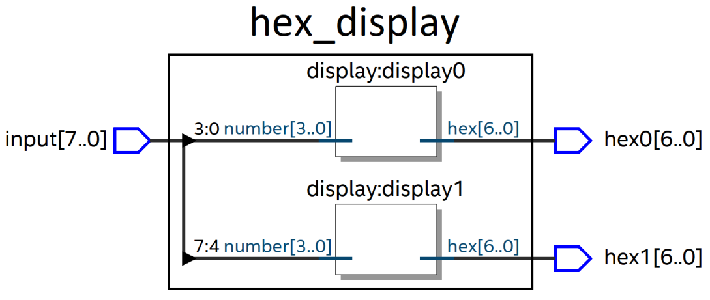

# L15 - Delkomponenter i VHDL, 7-segmentsdisplayer (del I)

## Dagordning
* Implementering av multipla moduler för utskrift av tal på 7-segmentsdisplayer.

## Mål med lektionen
* Kunna dela upp större konstruktioner i multipla moduler.
* Känna till hur binärkoder för 7-segmentsdisplayer fungerar.

## Förutsättningar
* Genomgång av L06 - L14 för grundläggande kunskaper om VHDL.

## Instruktioner

### Förberedelse
* Läs [bilaga A](#bilaga-a---delkomponenter-i-vhdl) nedan för grundläggande information om delkomponenter i VHDL.
* Se video tutorial gällande delkomponenter i VHDL [här](https://www.youtube.com/watch?v=2_FT-p-BdwE&feature=youtu.be).

### Under lektionen
* Genomför bifogade [övningsuppgifter](#bilaga-b---övningsuppgifter), som behandlar konstruktion av ett digitalt system innehållande 7-segmentsdisplayer. Vi kommer fortsätta arbeta med detta under nästa lektion.

### Demonstration
* Varje del av övningsuppgiften gås igenom i helklass efter att ni fått tid att implementera den på egen hand.

## Utvärdering
* Vad tyckte ni var mest intressant eller lärorikt under lektionen?
* Känner ni er trygga med användning av delkomponenter i VHDL?
* Har ni förslag på förbättringar eller önskemål inför kommande lektioner?

## Nästa lektion
* Vidare arbete med delkomponenter och 7-segmentsdisplayer.

---

## Bilaga A - Delkomponenter i VHDL

### Beskrivning
* I större digitala system är det vanligt att dela upp designen i flera mindre moduler (delkomponenter).
* Varje modul har en egen `entity` (utsida) och `architecture` (insida), och kan återanvändas i olika delar av systemet.
* Moduler kan kopplas ihop genom att instansiera en modul inuti en annan, likt att bygga med LEGO-klossar.

#### Exempel
Anta att vi har två moduler, en `or_gate` och en `and_gate`. Dessa kan kombineras i en tredje modul döpt `top_module`:

```vhdl
entity top_module is
	port(a, b: in std_logic;
		 x, y: out std_logic);
end entity;

architecture structure of top_module is
begin
	-- Create an or_gate instance, connect a, b, and x.
	OR1: entity work.or_gate
		port map(a, b, x);

	-- Create an and_gate instance, connect a, b, and y.
	AND1: entity work.and_gate
		port map(a, b, y);
end architecture;
```

* Här används `entity work.or_gate` samt `entity work.and_gate` för att instansiera modulerna.
* Genom att portar `a` och `b` kopplas till båda instanser har modulerna kopplats samman internt.
* På detta sätt kan man bygga upp komplexa system av enkla, återanvändbara byggblock.

---

## Bilaga B - Övningsuppgifter

### 1. Hexadecimala 7-segmentsdisplayer

Du ska konstruera ett digitalt system innehållande två 7-segmentsdisplayer samt åtta slide-switchar.  
På respektive 7-segmentsdisplay ska ett hexadecimalt tal $0-F$ visas. Talet som skrivs ut ska matas in biärt via fyra slide-switchar.

Eftersom två displayer används krävs totalt
* fyra switchar för den första displayen,
* fyra switchar för den andra displayen.

För att undvika att skriva samma kod två gånger ska du skapa
* en delkomponent (modul) som styr en 7-segmentsdisplay,
* två instanser av denna modul i toppmodulen.

**Projektnamn** (tillika toppmodulens namn): `hex_display`  
**Delkomponentens namn**: `display`

Systemets arkitekturvisas nedan:


Motsvarande SystemVerilog-kod finns i underkatalogen [systemverilog](./systemverilog/README.md).  
**Tips**: Ladda ned [hex_display.qar](./systemverilog/hex_display.qar), kompilera och testa på ett FPGA-kort för att få en överblick över funktionaliteten.

När konstruktionen är slutförd ska
* det 4-bitars binära tal som matas in via slide-switchar `input[7:3]` skrivas ut hexadecimalt på `hex1[6:0]`,
* det 4-bitars binära tal som matas in via slide-switchar `input[3:0]` skrivas ut hexadecimalt på `hex0[6:0]`.

---

**a)** Skapa ett projekt döpt `hex_display` i Quartus:  
* Placera projektet i en ny underkatalog `c/quartus/hex_display`.
* Döpt projektet till samma namn som toppmodulen (`hex_display`).
* Välj FPGA-kort Terasic DE0 (enhet `5CEBA4F23C7`).  

**b)** Lägg till toppmodulen hex_display innehållande följande portar:  
* `input[7:0]` : Insignaler från slide-switchar. 
* `hex1[6:0]` samt `hex0[6:0]`: Utsignaler till var sin 7-segmentsdisplay.

Lägg också till en tom arkitektur för toppmodulen och kompilera sedan koden. Korrigera eventuella fel.

**c)** Öppna Pin Planner och anslut portarna enligt nedan (se 
[databladet](../../manuals/DE0%20User%20ManuaL.pdf) för PIN-nummer):
* Anslut `input[7:0]` till slide-switchar `SW[7:0]`. 
* Anslut `hex1[6:0] till 7-segmentsdisplay `HEX1[6:0]` och `hex0[6:0]` till 7-segmentsdisplay `HEX0[6:0]`. 

Kompilera sedan om koden. 

**d)** Skapa en delkomponent döpt `display` i en fil döpt `display.vhd`. Denna delkomponent ska kunna användas för att kunna styra en 7-segmentsdisplay genom att ange ett 4-bitars binärt tal. 

Använd följande portar:
* `number[3:0]`: Insignal som utgörs av det tal som ska skrivas ut på ansluten 7-segmentsdisplay.
* `hex[6:0]`: Utsignal som tilldelas binärkoden för motsvarande tal (vilket skrivs till ansluten display).

Talet som ska skrivas ut på 7-segmentsdisplayen ska anges på 4-bitars binär form och matas till `number[3:0]`. Detta tal ska då skrivas ut hexadecimalt på ansluten 7-segmentsdisplay.  

Som exempel:
* Om `number[3:0]` matas med talet $0111_2$ ska binärkoden för talet $7_{16}$ skrivas till `hex[6:0]`.
* Om `number[3:0]` matas med talet $1110_2$ ska binärkoden för talet $E_{16}$ skrivas till `hex[6:0]`.

För att åstadkomma detta ska 7-segmentsdisplayen matas med motsvarande binärkod. Ni har tillgång till binärkoder för siffror $0 - 9$ nedan, resten (för $A - F$) måste ni lägga till själva:

```vhdl
constant DISPLAY_0  : std_logic_vector(6 downto 0) := "1000000";
constant DISPLAY_1  : std_logic_vector(6 downto 0) := "1111001";
constant DISPLAY_2  : std_logic_vector(6 downto 0) := "0100100";
constant DISPLAY_3  : std_logic_vector(6 downto 0) := "0110000";
constant DISPLAY_4  : std_logic_vector(6 downto 0) := "0011001";
constant DISPLAY_5  : std_logic_vector(6 downto 0) := "0010010";
constant DISPLAY_6  : std_logic_vector(6 downto 0) := "0000010";
constant DISPLAY_7  : std_logic_vector(6 downto 0) := "1111000";
constant DISPLAY_8  : std_logic_vector(6 downto 0) := "0000000";
constant DISPLAY_9  : std_logic_vector(6 downto 0) := "0010000";
-- Todo: Add DISPLAY_A – DISPLAY_F here!
constant DISPLAY_OFF: std_logic_vector(6 downto 0) := "1111111";
```

**Tips**: Använd en case-sats, som exekverar vid förändring av `input[3:0]` via en process. 

Kompilera om koden och korrigera eventuella fel.

**e)** Skapa två instanser av delkomponenten `display` i toppmodulen. Döp instanserna till `display1` respektive `display0`. 

För respektive instans ska fyra 7-segmentsdisplayer anslutas till `input[3:0]` och en 7-segmentsdisplay anslutas till `hex[6:0]`:
* Anslut `switch[7:4]` samt `hex1[6:0]` till instansen `display1`.
* Anslut `switch[3:0]` samt `hex0[6:0]` till instansen `display0`.

Kompilera om koden och korrigera eventuella fel.

**e)** Skapa en testbänk för modulen `display` och döp denna `display_tb`. Testa samtliga 16 kombinationer $0000 – 1111$ av `number[3:0]` och kontrollera att binärkoden som skrivs till `hex[6:0]` är korrekt (jämför med de framtagna binärkoderna).

**f)** Verifiera konstruktionen på ett FPGA-kort. 

**g)** Om tid finns, realisera konstruktionen med logiska grindar:
* Börja med fyra slide-switchar och en 7-segmentsdisplay - Ta fram logiska ekvationer för respektive segment. Verifiera implementationen i CircuitVerse.
* Kopiera befintligt grindnät för den andra 7-segmentsdisplayen. Detta motsvarar att vi skapar
en till instans av modulen `display` i VHDL istället för att duplicera koden.

---