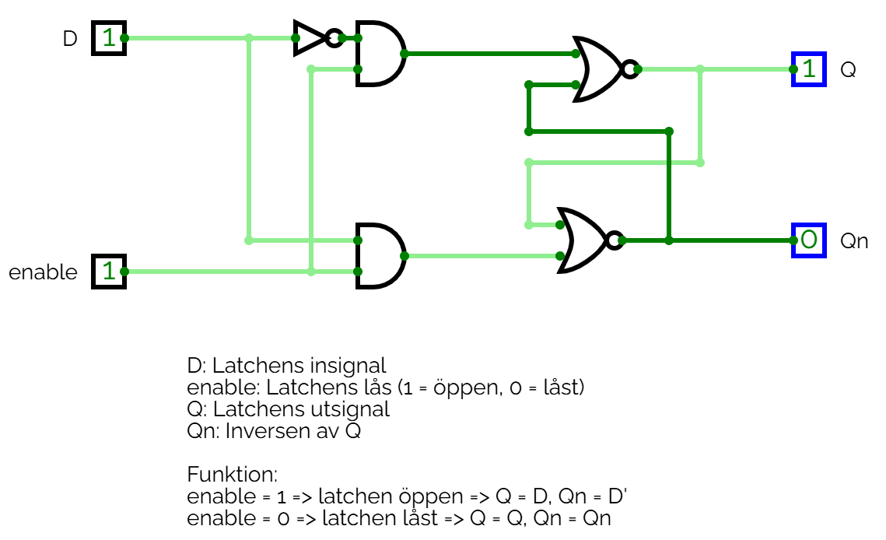
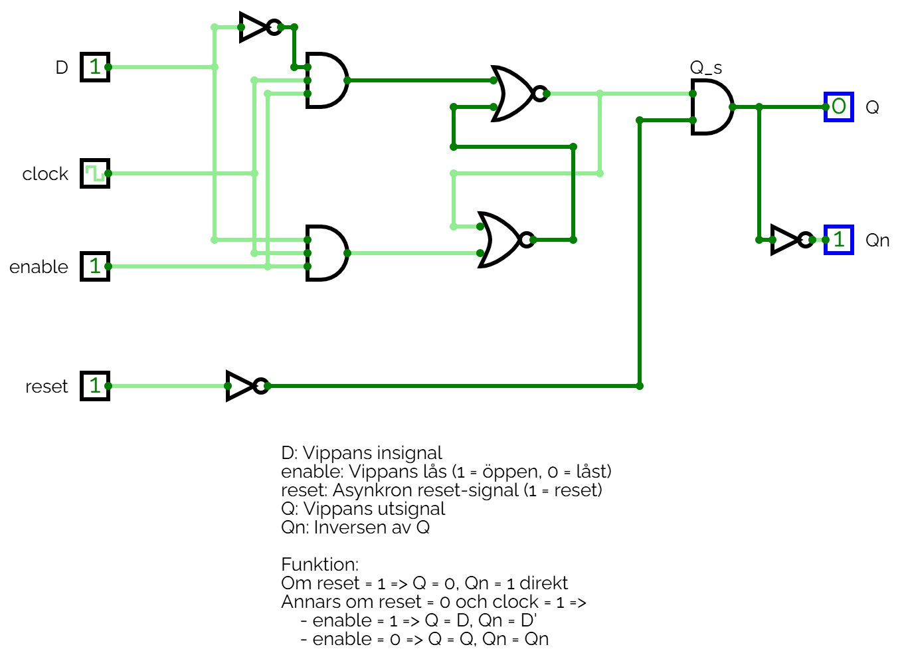
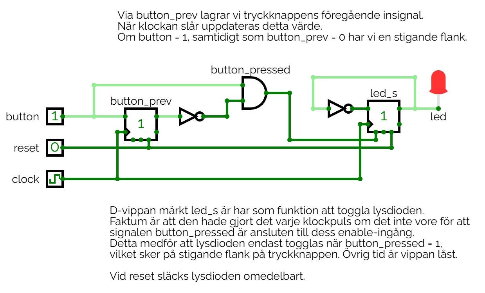

# L17 - Anteckningar
* Implementering av D-latchar samt D-vippor via grindar.
* Exempel på flankdetektering via D-vippor.
* Konstruktion av en D-vippa i VHDL.

---

### D-latchen
D-latchen visas i grindform nedan:

Ovanstående krets kan simuleras genom att öppna filen [d_latch.cv](./circuits/d_latch.cv) 
i [CircuitVerse](https://circuitverse.org/simulator).

---

### D-vippan
D-vippan med en asynkron reset visas i grindform nedan:

Ovanstående krets kan simuleras genom att öppna filen [d_flip_flop.cv](./circuits/d_flip_flop.cv) 
i [CircuitVerse](https://circuitverse.org/simulator).

### Flankdetektering med D-vippor
Ett system där D-vippor används för att detektera stigande flank på en tryckknapp samt toggla en
lysdiod visas nedan:

Ovanstående krets kan simuleras genom att öppna filen [led_toggle.cv](./circuits/led_toggle.cv) 
i [CircuitVerse](https://circuitverse.org/simulator).

---

### Konstruktion av en D-vippa i VHDL
Implementation av en D-vippa via en modul döpt `d_flip_flop`:
* Insignal `clock` har anslutits till en `50 MHz` systemklocka.
* Insignal `reset_n` har anslutits till en tryckknapp med aktivt låg signal.
* Insignaler `d` samt `enable` har anslutits till var sin slide-switch.
* Utsignaler `q` samt `q_n` har anslutits till var sin lysdiod.

#### Filer
* [d_flip_flop.vhd](./vhdl/d_flip_flop.vhd) innehåller konstruktionens toppmodul `d_flip_flop`.
* [d_flip_flop.qar](./vhdl/d_flip_flop.qar) utgör en arkiverad projektfil, som kan användas 
för att direkt öppna projektet, inklusive pins och testbänk, i Quartus.

---
