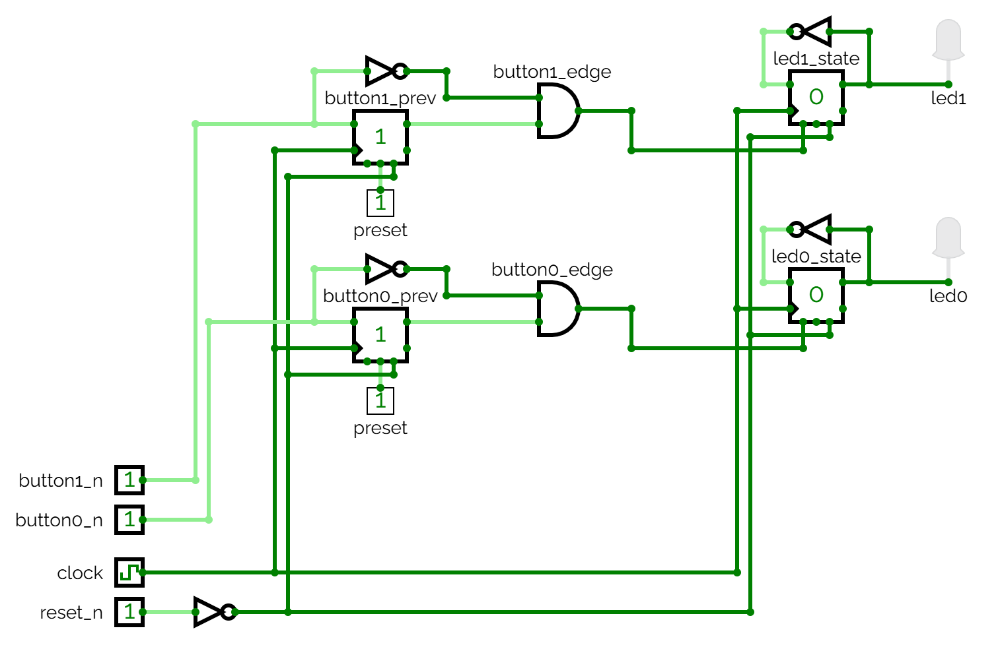

# L18 - Anteckningaar
Implementering av ett digitalt system innefattande flankdetektering för toggling av två lysdioder.

Konstruktionen innehåller följande portar:
* `clock`: Systemklocka, satt till 2 Hz i CircuitVerse, 50 MHz på FPGA-kortet.
* `reset_n`: Aktivt låg reset-signal från en tryckknapp.
* `button_n[1:0]`: Aktivt låga tryckknappar, som används för att toggla lysdioderna.
* `led[1:0]`: Lysdioder som togglas vid nedtryckning av motsvarande tryckknappar (på fallande flank).

---

## Kretsschema
Konstruktionens kretsschema visas nedan:

För varje delkrets med `button_n`, `button_prev_n`, `button_edge`, `led_state` samt `led` gäller att:
* Vippan `button_prev_n` lagrar föregående värde på `button_n`, dvs. tryckknappens värde från föregående klockcykel:
  * Vid reset (`reset_n = 0`) sätts `button_prev_n = 1` (via satt preset), eftersom `button_n` är aktiv låg.
  * När klockan slår uppdateras `button_prev_n` till det aktuella värdet på `button_n`, dvs. `button_prev_n = button_n`.
* AND-grinden `button_edge` blir etta vid fallande flank på `button_n`, dvs. i det ögonblick då knappen trycks ned:
  * Då gäller att `button_n = 0` (knappen är nu nedtryckt) och `button_prev_n = 1` (knappen var inte nedtryckt under föregående klockcykel).
  * Algebraiskt kan detta skrivas som  
    `button_edge = button_n' & button_prev_n`.
* Vippan `led_state` togglas när `button_edge = 1`, dvs. vid fallande flank på `button_n`, eftersom `button_edge` är ansluten till dess enable-ingång:
  * Vid reset (`reset_n = 0`) sätts `led_state = 0`, vilket släcker den anslutna lysdioden `led`.
  * När klockan slår togglas `led_state` om `button_edge = 1`, annars behålls föregående värde.
  * **Notera:** Om `button_edge` inte hade varit ansluten till enable-ingången hade `led_state` togglats vid varje klockcykel.
* `led` är direkt ansluten till `led_state`, vilket innebär att lysdioden tänds eller släcks beroende på värdet på `led_state`.

Ovanstående krets kan simuleras genom att öppna filen [led_toggle1.cv](./circuit/led_toggle1.cv) 
i [CircuitVerse](https://circuitverse.org/simulator).

## Syntes samt simulering i VHDL
* [led_toggle1.vhd](./vhdl/led_toggle1.vhd) innehåller konstruktionens toppmodul `led_toggle1`.
* [led_toggle1.qar](./vhdl/led_toggle1.qar) utgör en arkiverad projektfil, som kan användas 
för att direkt öppna projektet, inklusive pins och testbänk, i Quartus.

---