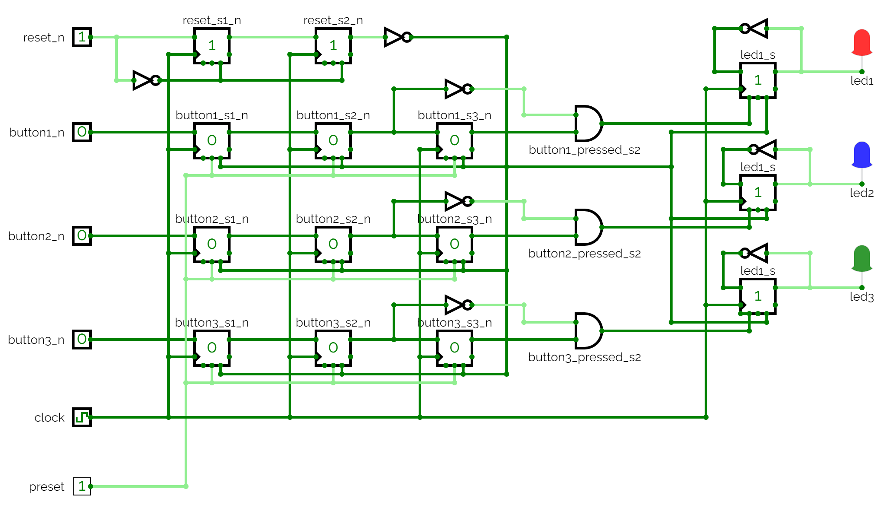

# L20 - Anteckningar
Implementering av ett digitalt system innefattande flankdetektering för toggling av 1-3 lysdioder:
* En generisk parameter `DEVICE_COUNT` används för val av antalet tryckknappar och lysdioder i en konstruktion.
* Metastabilitetsskydd har lagts till för att säkerhetsställa att samtliga insignaler är stabila
(0 eller 1) när de används i konstruktionen. När detta genomförs säger man att insignalerna synkroniseras.

Konstruktionen innehåller följande portar:
* `clock`: Systemklocka, satt till 1 Hz i CircuitVerse, 50 MHz på FPGA-kortet.
* `reset_n`: Aktivt låg reset-signal från en tryckknapp.
* `button_n`: Aktivt låga tryckknappar, som används för att toggla lysdioderna.
* `led`: Lysdioder som togglas vid nedtryckning av motsvarande tryckknappar (på fallande flank).

Reset-signalen `reset_n` synkroniseras via två D-vippor. Motsvarande synkroniserad reset-signal `reset_s2_n` används sedan i resten av kretsen. Postfix `s2` innebär att signalen i fråga har synkroniserats med två vippor i enlighet med `double flop`-metoden.

Tryckknappar `button_n` synkroniseras via två D-vippor och ytterligare en vippa används för flankdetektering, där `button_s2_n` utgör "nuvarande" insignal och `button_s3_n` utgör "föregående" insignal. Vid nedtryckning (fallande flank) gäller att `button_s2_n` = 0 och `button_s3_n` = 1. Då ettställs signalen `button_edge_s2` för att indikera knapptryckning.
När `button_edge_s2` ettställs togglas motsvarande lysdiod `led`.

## Kretsschema
Konstruktionens kretsschema visas nedan:

Gällande kretsschemat:
* `reset_s2_n` är vår stabila reset-signal, som används i resten av nätet.
* Vi lägger till två vippor för att stabilisera respektive knappsignal, samt en tredje för att implementera flankdetektering:
    * `button_s2_n` är "nuvarande" värde. 
    * `button_s3_n` är "föregående" värde.
* Vi detekterar fallande flank på `button_n` med `button_edge_s2`:
    * `button_edge_s2 = 1` när `button_s2_n = 0` och `button_s3_n = 1`.
    * Med andra ord, knappen är nu nedtryckt, men var inte det föregående klockpuls.
* `led_state` håller respektive lysdiods tillstånd:
    * Vi skapar en toggle-vippa genom att koppla inversen av utsignalen till ingången.
    * Vi kopplar `button_edge_s2` till enable-ingången så att toggling bara sker vid fallande flank, dvs. när `button_edge_s2 = 1`.

Ovanstående krets kan simuleras genom att öppna filen [led_toggle_meta_prev.cv](./circuit/led_toggle_meta_prev.cv) 
i [CircuitVerse](https://circuitverse.org/simulator).

## Syntes samt simulering i VHDL
* [led_toggle_meta_prev.vhd](./vhdl/led_toggle_meta_prev.vhd) innehåller konstruktionens toppmodul `led_toggle_meta_prev`.
* [meta_prev.vhd](./vhdl/meta_prev.vhd) innehåller modulen `meta_prev`, som används för att synkronisera insignalerna med `double flop`-metoden samt att detektera fallande flank på tryckknapparna `button_n`. Denna modul är generisk, vilket möjliggör att 1-3 knappar kan synkroniseras.
* [led_toggle_meta_prev.qar](./vhdl/led_toggle_meta_prev.qar) utgör en arkiverad projektfil, som kan användas för att direkt öppna projektet, inklusive pins och testbänk, i Quartus.

---
