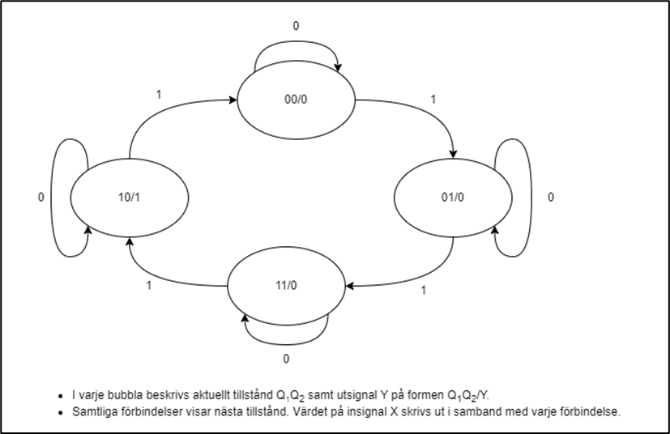

# L26 - Konstruktion av tillståndsmaskiner (del I)

## Dagordning
* Konstruktion av tillståndsmaskiner i hårdvara med simulering i CircuitVerse.

## Mål med lektionen
* Känna till hur tillståndsmaskiner är uppbyggda i hårdvara.

## Förutsättningar
* Genomgång av L17 - L24 för kunskaper om synkrona VHDL-konstruktioner.

## Instruktioner

### Förberedelse
* Repetera innehållet från L17 - L24.

### Under lektionen
* Genomför bifogade [övningsuppgifter](#bilaga-a---övningsuppgifter).

## Nästa lektion
* Konstruktion av tillståndsmaskiner i VHDL.

---

## Bilaga A - Övningsuppgifter

Du ska skapa en tillståndsmaskin bestående av fyra tillstånd:
* `STATE_0`: Motsvarar `00` i hårdvara.
* `STATE_1`: Motsvarar `01` i hårdvara.
* `STATE_2`: Motsvarar `11` i hårdvara.
* `STATE_3`: Motsvarar `10` i hårdvara.

Tillståndsmaskinen är: 
* Av Moore-typ, där utsignalen enbart beror på aktuellt tillstånd.
* Sluten på så sätt att nästa tillstånd efter `STATE_3` är `STATE_0`.
* Endast tillståndsregister `{Q1, Q2}` lagrar tillstånd; all kombinationslogik härleds från tillståndstabellen.

### Vippor
* För att lagra respektive tillståndsbit (såsom `00` eller `01` ovan) krävs en vippa. 
* För fyra olika tillstånd krävs därmed två vippor. 
* Låt oss kalla vippornas utsignaler `Q1` respektive `Q2`.

### Portar
* En systemklocka döpt `clock` med en periodtid på `1000 ms` ska användas i konstruktionen.
* En inverterande reset-signal döpt `reset_n` ska användas för att återställa tillståndet till startläget `STATE_0`.
* En inverterande tryckknapp döpt `button_n` ska används för att byta tillstånd till nästa (vid fallande flank).
* En lysdiod döpt `led` ska tändas i `STATE_3`, övrig tid ska den vara släckt. 

### Flödesdiagram
Tillståndsmaskinens flödesdiagram visas nedan.
* `X` representerar en synkroniserad och flankdetekterad puls från `button_n`, som är hög under en klockcykel 
vid fallande flank på tryckknappen `button_n`.
* Utsignal `Y` ska anslutas direkt till lysdioden `led`.

### Detaljer
* Kretsen ska implementeras synkront med en asynkron reset; samtliga signaler i kretsen uppdateras vid stigande flank på `clock` eller när `reset_n` är låg.
* När `reset_n` är låg ska systemåterställning ske, vilket innebär att samtliga signaler ska sättas i startläget (och `led` ska då släckas).
* Kretsen ska också göras mer robust via förebyggande av metastabilitet. För att åstadkomma detta ska *double flop*-metoden användas. Därmed ska varje insignal (förutom systemklockan) synkroniseras via två vippor var.

### Uppgifter
 
**a)** Fyll i tillståndsdiagrammet för tillståndsmaskinen nedan i enlighet med ovanstående flödesdiagram.  

Notera att:
* `Q1Q2` utgör aktuellt tillstånd.
* `X` är ettställd vid fallande flank på tryckknappen och innebär att vi ska byta till nästa tillstånd.
* `Y` utgör grindnätets utsignal, som ansluts till en lysdiod.
* `Q1+Q2+` utgör nästa tillstånd.

| Q1 | Q2 | X | Q1+ | Q2+ | Y |
|----|----|---|-----|-----|---|
| 0  | 0  | 0 | 0   | 0   | 0 |
| 0  | 0  | 1 | 0   | 1   | 0 |
| 0  | 1  | 0 | 0   | 1   | 0 |
| 0  | 1  | 1 |     |     |   |
| 1  | 0  | 0 |     |     |   |
| 1  | 0  | 1 |     |     |   |
| 1  | 1  | 0 |     |     |   |
| 1  | 1  | 1 |     |     |   |

**b)** Härled ekvationer för:
* Nästa tillstånd `Q1+` samt `Q2+` utefter insignaler `{Q1, Q2, X}` via Karnaugh-diagram. 
* Utsignal `Y` utefter aktuellt tillstånd `{Q1, Q2}`.

**c)** Realisera motsvarande grindnät för hand. Implementera `{Q1, Q2}` i form av var sin D-vippa. 

**d)** Realisera konstruktionen och simulera i CircuitVerse:
* Lägg till metastabilitetsskydd via *double flop*-metoden samt eventdetektering för `button_n`. 
* Se till att insignal `X` ettställs enbart på fallande flank på `button_n`. 
* Anslut utsignal `Y` till `led`. Se till att `led` enbart tänds i tillstånd `STATE_3`, dvs. då `{Q1, Q2} = {1, 0}`.

---
