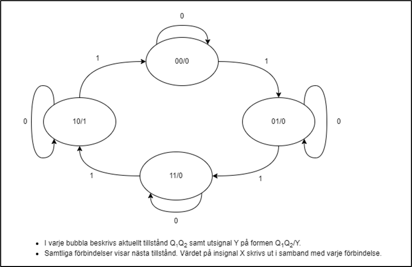
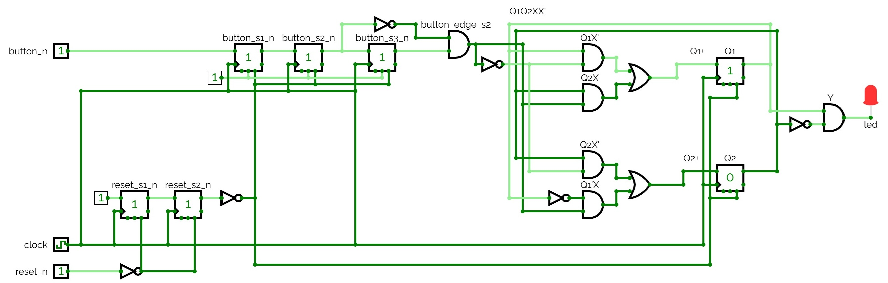

# L26 - Anteckningar

## Beskrivning
Implementering av en tillståndsmaskin bestående av fyra tillstånd:
* `STATE_0`: Motsvarar `00` i hårdvara.
* `STATE_1`: Motsvarar `01` i hårdvara.
* `STATE_2`: Motsvarar `11` i hårdvara.
* `STATE_3`: Motsvarar `10` i hårdvara.

Notera att tillståndsordningen följer sekvensen:
`00 → 01 → 11 → 10 → 00`, vilket motsvarar en Gray-kod.

Tillståndsmaskinen: 
* Är av Moore-typ, där utsignalen enbart beror på aktuellt tillstånd.
* Fungerar som en cirkulär räknare (Gray-kod), där varje knapptryckning flyttar systemet ett steg framåt i sekvensen. 
* Endast ett bitbyte sker mellan varje tillstånd, vilket minimerar risken för glitchar i hårdvara.
* Endast tillståndsregister `{Q1, Q2}` lagrar tillstånd; all kombinationslogik härleds från tillståndstabellen.


---

## Vippor
* För att lagra respektive tillståndsbit (såsom `00` eller `01` ovan) används en vippa. 
* För fyra olika tillstånd krävs därmed två vippor. 
* Dessa vippors utsignaler kallas här `Q1` respektive `Q2`.
* `Q1` är MSB och `Q2` är LSB i tillståndsrepresentationen.

---

## Portar
* En systemklocka döpt `clock` med en periodtid på `1000 ms` används i konstruktionen.
* En inverterande reset-signal döpt `reset_n` återställer tillståndet till startläget `STATE_0`.
* En inverterande tryckknapp döpt `button_n` byter tillstånd till nästa (vid fallande flank).
* En lysdiod döpt `led` tänds i `STATE_3`, övrig tid hålls den släckt.

---

## Flödesdiagram
Tillståndsmaskinens flödesdiagram visas nedan:
* `X` representerar en synkroniserad och flankdetekterad puls från `button_n`, som är hög under exakt en klockcykel vid fallande flank på tryckknappen `button_n`.
* Utsignal `Y` ansluts direkt till lysdioden `led`.



---

## Detaljer
Kretsen har implementerats synkront med en asynkron reset:
* Samtliga signaler uppdateras vid stigande flank på `clock`. 
* Vid låg `reset_n` sker en asynkron återställning, vilket innebär att samtliga signaler sätts i startläget (och `led` släcks då).
* Kretsen har också gjorts mer robust via förebyggande av metastabilitet. För att åstadkomma detta har "double flop"-metoden använts.

---

## Tillståndsdiagram
Tillståndsmaskinens tillståndsdiagram visas nedan:

Notera att:
* `{Q1, Q2}` utgör aktuellt tillstånd.
* `X` är ettställd vid fallande flank på tryckknappen och innebär att vi ska byta till nästa tillstånd.
* `Y` utgör grindnätets utsignal, som ansluts till en lysdiod.
* `{Q1+, Q2+}` utgör nästa tillstånd.

| Q1 | Q2 | X | Q1+ | Q2+ | Y |
|----|----|---|-----|-----|---|
| 0  | 0  | 0 | 0   | 0   | 0 |
| 0  | 0  | 1 | 0   | 1   | 0 |
| 0  | 1  | 0 | 0   | 1   | 0 |
| 0  | 1  | 1 | 1   | 1   | 0 |
| 1  | 0  | 0 | 1   | 0   | 1 |
| 1  | 0  | 1 | 0   | 0   | 1 |
| 1  | 1  | 0 | 1   | 1   | 0 |
| 1  | 1  | 1 | 1   | 0   | 0 |

---

## Logiska ekvationer
Ekvationer för nästa tillstånd `Q1+` samt `Q2+` härleddes från insignaler `{Q1, Q2, X}` via Karnaugh-diagram. Följande ekvationer härleddes:

```text
Q1+ = Q1X' + Q2X
Q2+ = Q2X' + Q1'X
```

Notera symmetrin i uttrycken:
* `Q1+` och `Q2+` har liknande struktur.
* `X` fungerar som en växlingssignal mellan tillstånd.

* Utsignal `Y` beräknades enkelt utefter aktuellt tillstånd `{Q1, Q2}`; `Y = 1` när `{Q1, Q2} = {1, 0}`, vilket skrivs på boolesk algebra enligt nedan:

```text
Y = Q1 * Q2'
```

---

## Kretsschema
Konstruktionens kretsschema visas nedan:



Ovanstående krets kan simuleras genom att öppna filen [fsm.cv](./circuit/fsm.cv) i [CircuitVerse](https://circuitverse.org/simulator).

---
