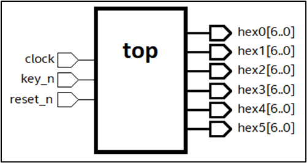

# L28 - Egenvalt projekt (del I)

## Dagordning
* Arbete med egenvalt projekt.

## Mål med lektionen
* Ha kommit på och börjat utveckla ett egenvalt projekt.

## Instruktioner
* Läs [instruktionerna](#bilaga-a---instruktioner-för-egenvalt-projekt) nedan.
* Se gärna [exempelprojektet](#bilaga-b---exempelprojekt) (G-nivå) nedan. Om ni inte kommer på något
eget projekt är det okej att genomföra detta.

## Nästa lektion
* Vidare arbete med det egenvalda projektet.

---

## Bilaga A - Instruktioner för egenvalt projekt
* Ni har under de sista tre föreläsningarna möjlighet att skapa ett eget projekt i VHDL.
* Detta projekt ger upp till `4p`, varav `G = 2p`, `VG = 4p`. 

### Krav
De enda kraven på projektet är att konstruktionen:
* är synkron, dvs. följer en systemklocka.
* har en asynkron reset-signal.
* har skydd mot metastabilitet.
* innehåller multipla moduler, exempelvis för
    * flankdetektering, 
    * metastabilitetsskydd, 
    * 7-segmentsdisplayer, 
    * tillståndsmaskiner,
    * timerkretsar.

### Övrigt
* Projektet ska genomföras självständigt.
* Diskutera med läraren kring era projektidéer samt betygsnivå.
* Projektet ska redovisas för läraren.

---

## Bilaga B - Exempelprojekt

***OBS!** Detta projekt motsvarar G-nivå.*

Ni ska enskilt konstruera en digital 24-timmars klocka, som ska valideras via ett FPGA-kort. Tiden ska visas på sex 7-segmentsdisplayer. Klockan ska kunna räkna upp från tiden `00:00:00` till `23:59:59`. I figuren nedan visas konstruktionens toppmodul `top` i dess grundform:

### Portar
Toppmodulen `top` har i sin grundform följande portar:
* Insignal `clock` ska utgöras av en `50 MHz` intern klocka på FPGA-kortet.
* Insignal `key_n` ska utgöras av en styrsignal för att starta respektive stoppa klockan.
* Insignal `reset_n` ska användas som asynkron reset-signal för att återställa klockan till startläget (tiden `00:00:00`).
* Utsignaler `hex[5:0]` ska utgöras 7-segmentsdisplayer som var och en visar en siffra `0-9`. 
Tillsammans ska displayerna visa en tid på formen `HH:MM:SS`, där `hex[5:4]` visar aktuell timme, `hex[3:2]` visar aktuell minut och `hex[1:0]` visar aktuell sekund.

### Uppräkning av klockan
* Efter slutförd konstruktion ska den digitala klockan kunna genomföra kontinuerlig uppräkning i `24` timmar, mätt från tiden `00:00:00` upp till `23:59:59`, där aktuell tid i form av timme, minut och sekund visas på sex 7-segmentsdisplayer. 
* Vid fortsatt uppräkning ska klockan sedan räkna om från tiden `00:00:00` igen. 

### Start/stopp av klockan
* Klockan ska vid behov kunna startas och stoppas via en tryckknapp döpt `key_n`. Vid start ska klockan vara avstängd, samtidigt som tiden `00:00:00` skrivs ut på displayerna, och måste då startas via nedtryckning av denna tryckknapp. 
* När klockan är påslagen medför nedtryckning av samma tryckknapp `key_n` att klockan stannar och då ska aktuell tid på 7-segmentsdisplayerna stå kvar. 
* Via nedtryckning av samma tryckknapp ska klockan sedan kunna startas igen och fortsätta där den stannade.

### Systemåterställning
* I konstruktionen ska också en reset-signal implementeras, som vid aktivering medför total systemåterställning, där klockan nollställs och stoppas. 
* Denna reset-signal ska realiseras via en tryckknapp döpt `reset_n`. 
* Efter systemåterställning måste användaren manuellt starta om klockan via nedtryckning av tryckknappen `key_n` igen.

### Metastabilitetsskydd
* Konstruktionen ska inneha skydd mot metastabilitet via användning av *double flop*-metoden.

### Betyg
* Vid slutförd konstruktion och redovisning ges godkänt (`G = 2p`).

---
