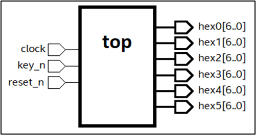

# L28 - Egenvalt projekt (del I)

## Dagordning
* Arbete med egenvalt projekt.

## Mål med lektionen
* Ha kommit på och börjat utveckla ett egenvalt projekt.

## Instruktioner
* Läs [instruktionerna](#bilaga-a---instruktioner-för-egenvalt-projekt) nedan.
* Se gärna [exempelprojektet](#bilaga-b---exempelprojekt) (G-nivå) nedan. Om ni inte kommer på något
eget projekt är det okej att genomföra detta.

## Nästa lektion
* Vidare arbete med det egenvalda projektet.

---

## Bilaga A - Instruktioner för egenvalt projekt
* Ni har under de sista tre föreläsningarna möjlighet att skapa ett eget projekt i VHDL.
* Detta projekt ger upp till `4p`, varav `G = 2p`, `VG = 4p`. 

### Krav
De enda kraven på projektet är att konstruktionen:
* är synkron, dvs. följer en systemklocka.
* har en asynkron reset-signal.
* har skydd mot metastabilitet.
* innehåller multipla moduler, exempelvis för
    * flankdetektering, 
    * metastabilitetsskydd, 
    * 7-segmentsdisplayer, 
    * tillståndsmaskiner,
    * timerkretsar.

### Övrigt
* Projektet ska genomföras självständigt.
* Diskutera med läraren kring era projektidéer samt betygsnivå.
* Projektet ska redovisas för läraren.

### Exempelprojekt
Nedan följer exempel på projektidéer anpassade för **Terasic DE0**. Projekten ska endast använda kortets inbyggda resurser, såsom **tryckknappar**, **slide switches**, **LED:ar** och **7-segmentsdisplayer**. Dessa är endast förslag – ni får gärna komma på egna idéer i samråd med läraren.

#### Enklare projekt (G-nivå)
* **Reaktionstidstest**
  * En LED tänds efter en fördröjning.
  * Användaren ska trycka på en knapp så snabbt som möjligt.
  * Reaktionstiden visas på 7-segmentsdisplay.
  * Kan exempelvis använda en knapp för start och en annan för reset.

* **Nedräkningstimer**
  * En timer som räknar ned från ett förinställt tvåsiffrigt värde till `0`.
  * Start/stopp via knapp.
  * Tiden kan ställas in med slide switches.
  * När tiden är slut blinkar en lysdiod med valfri blinkhastighet.

* **Poängräknare för två spelare**
  * Två knappar används för att öka poäng för respektive spelare.
  * Resultatet visas på 7-segmentsdisplayer.
  * En knapp kan användas för reset.

* **Elektronisk tärning**
  * Tryck på en knapp för att "kasta" tärningen.
  * Talet `1–6` visas på en 7-segmentsdisplay eller via LED-mönster.

---

#### Mer avancerade projekt (VG-nivå)
* **Trafikljussystem**
  * Implementera ett trafikljus med sekvenser för rött, gult och grönt.
  * LED:ar används som trafikljus.
  * Tillståndsmaskin styr växlingen mellan olika lägen.
  * En knapp kan användas för gångtrafikantbegäran.
  * 7-segmentsdisplay kan visa nedräkningstid.

* **Kodlås**
  * En kod anges med slide switches.
  * En knapp används för att bekräfta inmatning.
  * Systemet låses upp vid korrekt kod och visar resultat via LED eller display.
  * Konstruktionen kan utökas med felräknare eller timeout.

* **Simon Says / minnesspel**
  * Systemet visar en sekvens via LED:ar.
  * Användaren återupprepar sekvensen med knappar eller switchar.
  * Sekvensen växer successivt.
  * Resultat eller nivå kan visas på 7-segmentsdisplay.

* **Avancerat stoppur/timer**
  * Flera lägen, exempelvis stoppur, nedräkning och paus.
  * Val av läge kan göras med slide switches.
  * Visning sker på 7-segmentsdisplayer.
  * Konstruktionen ska innehålla tydlig moduluppdelning och minst en tillståndsmaskin.

* **Parkeringsräknare**
  * Knappar används för att simulera "bil in" och "bil ut".
  * Aktuellt antal visas på display.
  * LED:ar kan indikera när parkeringen är full.
  * Systemet ska hantera gränsfall, exempelvis att antalet inte får bli negativt.

---

## Bilaga B - Exempelprojekt

***OBS!** Detta projekt motsvarar G-nivå.*

Ni ska enskilt konstruera en digital 24-timmars klocka, som ska valideras via ett FPGA-kort. Tiden ska visas på sex 7-segmentsdisplayer. Klockan ska kunna räkna upp från tiden `00:00:00` till `23:59:59`. I figuren nedan visas konstruktionens toppmodul `top` i dess grundform:

### Portar
Toppmodulen `top` har i sin grundform följande portar:
* Insignal `clock` ska utgöras av en `50 MHz` intern klocka på FPGA-kortet.
* Insignal `key_n` ska utgöras av en styrsignal för att starta respektive stoppa klockan.
* Insignal `reset_n` ska användas som asynkron reset-signal för att återställa klockan till startläget (tiden `00:00:00`).
* Utsignaler `hex[5:0]` ska utgöras 7-segmentsdisplayer som var och en visar en siffra `0-9`. 
Tillsammans ska displayerna visa en tid på formen `HH:MM:SS`, där `hex[5:4]` visar aktuell timme, `hex[3:2]` visar aktuell minut och `hex[1:0]` visar aktuell sekund.

### Uppräkning av klockan
* Efter slutförd konstruktion ska den digitala klockan kunna genomföra kontinuerlig uppräkning i `24` timmar, mätt från tiden `00:00:00` upp till `23:59:59`, där aktuell tid i form av timme, minut och sekund visas på sex 7-segmentsdisplayer. 
* Vid fortsatt uppräkning ska klockan sedan räkna om från tiden `00:00:00` igen. 

### Start/stopp av klockan
* Klockan ska vid behov kunna startas och stoppas via en tryckknapp döpt `key_n`. Vid start ska klockan vara avstängd, samtidigt som tiden `00:00:00` skrivs ut på displayerna, och måste då startas via nedtryckning av denna tryckknapp. 
* När klockan är påslagen medför nedtryckning av samma tryckknapp `key_n` att klockan stannar och då ska aktuell tid på 7-segmentsdisplayerna stå kvar. 
* Via nedtryckning av samma tryckknapp ska klockan sedan kunna startas igen och fortsätta där den stannade.

### Systemåterställning
* I konstruktionen ska också en reset-signal implementeras, som vid aktivering medför total systemåterställning, där klockan nollställs och stoppas. 
* Denna reset-signal ska realiseras via en tryckknapp döpt `reset_n`. 
* Efter systemåterställning måste användaren manuellt starta om klockan via nedtryckning av tryckknappen `key_n` igen.

### Metastabilitetsskydd
* Konstruktionen ska inneha skydd mot metastabilitet via användning av "double flop"-metoden.

### Betyg
* Vid slutförd konstruktion och redovisning ges godkänt (`G = 2p`).

---
